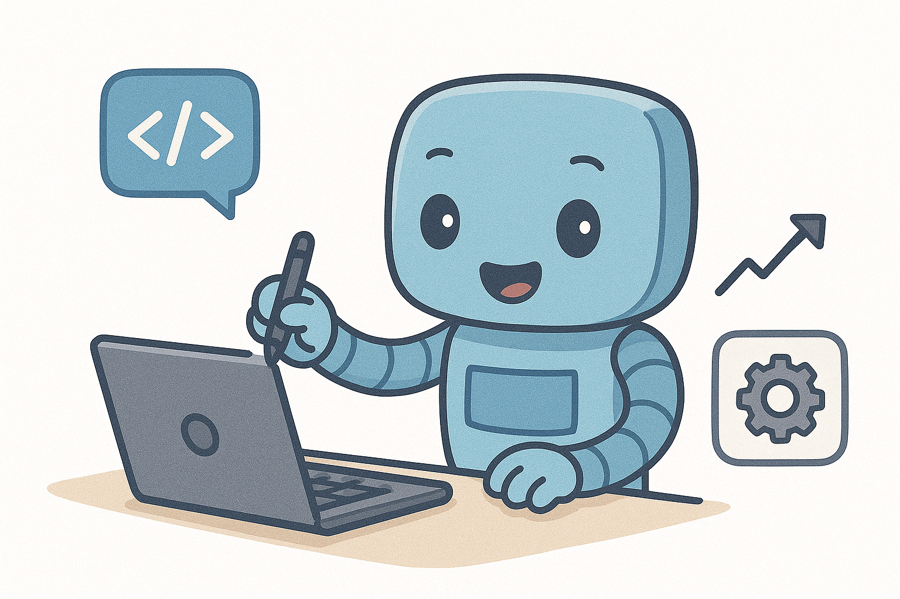

  

<h1 align="center">
    <strong>AI Dev Tools Zoomcamp: Write Better Code Faster</strong>
</h1>

Welcome to the AI Dev Tools Zoomcamp, a free course that helps you use AI tools to write better code, faster.

Links:

* [`#course-ai-dev-tools-zoomcamp` on Slack](https://app.slack.com/client/T01ATQK62F8/C09HWT76L95)
* [Telegram Channel with Announcements](https://t.me/aidevtoolszoomcamp)
* [FAQ](https://docs.google.com/document/d/1uBSxORcxOewXMzMDHwADpVSiS0kBRXhTQ3qWd86CjlI/edit)
* [Course Playlist](https://www.youtube.com/watch?v=sUwrCnP2iGU&list=PL3MmuxUbc_hLuyafXPyhTdbF4s_uNhc43)
* [Course Launch Stream](https://www.youtube.com/watch?v=58pn873XO04&list=PL3MmuxUbc_hLuyafXPyhTdbF4s_uNhc43)
* [Article with details about the course](https://datatalks.club/blog/ai-dev-tools-zoomcamp-2025-free-course-to-master-coding-assistants-agents-and-automation.html)

## How to Join?

We're starting the first cohort of this course on November 18, 2025!

[Sign up here](https://airtable.com/appJRFiWKHBgmEt70/shrpw7rk55Ewr1jCG) to join us.

## Who Is This For?

This course is for anyone who wants to use AI tools to help with coding.

You don't need any AI experience to start - just curiosity about using AI tools to help with your coding!

## What We'll Cover

### Module 1 — [Introduction to Vibe Coding / AI Tools Overview](01-overview/)

* AI-assisted development with Snake game example (React + JS)
* Chat applications: ChatGPT, Claude, DeepSeek, Microsoft Copilot
* Coding assistants / IDEs: Claude Code, GitHub Copilot, Cursor, Pear
* Project bootstrappers: Bolt, Lovable
* Agents: Anthropic Computer Use, PR Agent, others

### Module 2 — [End-to-End Project (Snake)](02-end-to-end/)

- Use a coding assistant for an end-to-end project
- Build Snake in React/TS
- Define API with OpenAPI
- Generate FastAPI server from OpenAPI specs
- Add CI/CD
- Deploy the application

### Module 3 — [Model-Context Protocol](03-mcp/)

- Enhancing AI assistants with tools 
- Core servers: GitHub, Filesystem, DB/SQL, HTTP/API, CI
- Practical workflows: repo triage, PR summarization, scripted edits, data queries
- Local vs. remote servers
- Security/permissions

### Module 4 — [Build an AI Coding Agent (for Django)](04-build-coding-agent/)

- Build your own coding agent that can scaffold and extend projects
- Use a Django template as the base project
- Learn how agents act as project bootstrappers
- Explore multiple agent orchestration frameworks
- Outcome: a Django app created and modified by your AI agent

### Module 5 — [AI for Testing, CI/CD & DevOps](05-cicd-devops/)

- AI-assisted PR reviews/summaries and change-risk hints
- Automated test generation, coverage gates, and LLM evals in CI
- Release notes, changelog drafting, and deployment runbooks
- Incident postmortems and on-call copilots

### Module 6 — [Automation with Low-Code and No-Code AI (n8n)](06-automation-lowcode/)

- Install N8N
- Create posts for LinkedIn
- Tailor your CV for a specific position

## Your Instructors

- [Alexey Grigorev](https://linkedin.com/in/agrigorev)
- [Bhavani Ravi](https://www.linkedin.com/in/bhavanicodes)
- [Moein Foroughi](https://www.linkedin.com/in/moein-foroughi-ce/)

## Testimonials

> This course fundamentally changed how I approach AI development. I moved from “building models” to designing AI-assisted systems that are faster to ship and easier to iterate on.
>
> During the course, I built:
>
> - A portfolio optimization tool powered by AI-assisted development
> - A full-stack application using ChatGPT, Lovable, and Antigravity
> - A structured GitHub project with clean documentation and reproducible workflow
>
> What changed for me:
> I now think in terms of system design rather than isolated scripts. I learned how to structure AI tool usage, validate outputs, and integrate generated code into disciplined engineering workflows. The biggest shift was moving from experimentation to controlled, production-oriented iteration. I can now prototype and deploy AI-enabled tools significantly faster without sacrificing rigor.
>
> — [Yann Pham-Van](https://www.linkedin.com/in/chasseur2valeurs/), Freelance Data Scientist

> The course taught me how to use coding agents effectively, debug issues, and gave me exposure to MCPs, tools, and prompts. It helped me conceptualize any idea into a working prototype. And finally, it helped me land a job after a long career break!
> 
> — [Revathy Ramalingam](https://www.linkedin.com/in/revathy-ramalingam/), Senior Software Engineer at Yalabs Solutions

> During the course I built a Finnish learning website which helps English users learn and practice their reading, writing, listening and speaking skills for the Finnish language.
>
> Tech Stack:
> - IDE: Antigravity IDE with Gemini 3 Pro High & Claude Opus 4.5 Thinking (switching LLMs depending on available capacity relative to rate limits)
> - MCP server: Context7 documentation MCP server (for Antigravity IDE's LLM to retrieve the relevant documentation if it is unsure of a library's syntax)
> - Language: TypeScript (frontend), Python (backend)
> - Framework: Next.js (frontend), FastAPI (backend)
> - Database: SQLite
> - Styling: Tailwind CSS
> - Package Manager: npm
> - Final Deployment: Render (serving the full frontend AND backend as a "Single Docker Container" Microservice)
> - Transcription: Client-side Google Web Speech API
> - LLM: gemma-3-27b (grades Finnish speech transcribed to text format)
> - CI/CD with GitHub Actions to run backend unit tests using Pytest, frontend unit tests using Jest, and full-stack end-to-end tests using Playwright
> 
> What Changed For Me
> 1. Learning a systematic way to think about the requirements and design an application, before developing and testing various components of the application iteratively
> 2. Learning to package frontend and backend components into a single container for easier deployment
> 3. Practising how to debug frontend and backend tests, which tend to break things when I started to integrate the frontend, backend and database together, and when moving from deploying the container locally to deploying on the cloud
>
> — [Kaiquan Mah](https://www.linkedin.com/in/kaiquan-mah), Data Scientist at Total eBiz Solutions

## About DataTalks.Club

DataTalks.Club is a community of data enthusiasts learning and growing together. We're all about sharing knowledge, helping each other out, and making data science more accessible.

Join us:
• [Website](https://datatalks.club/)
• [Slack Community](https://datatalks.club/slack.html)
• [Newsletter](https://us19.campaign-archive.com/home/?u=0d7822ab98152f5afc118c176&id=97178021aa)
• [Events](http://lu.ma/dtc-events)
• [Calendar](https://calendar.google.com/calendar/?cid=ZjhxaWRqbnEwamhzY3A4ODA5azFlZ2hzNjBAZ3JvdXAuY2FsZW5kYXIuZ29vZ2xlLmNvbQ)
• [YouTube](https://www.youtube.com/@DataTalksClub/featured)
• [GitHub](https://github.com/DataTalksClub)
• [LinkedIn](https://www.linkedin.com/company/datatalks-club/)
• [Twitter](https://twitter.com/DataTalksClub)
