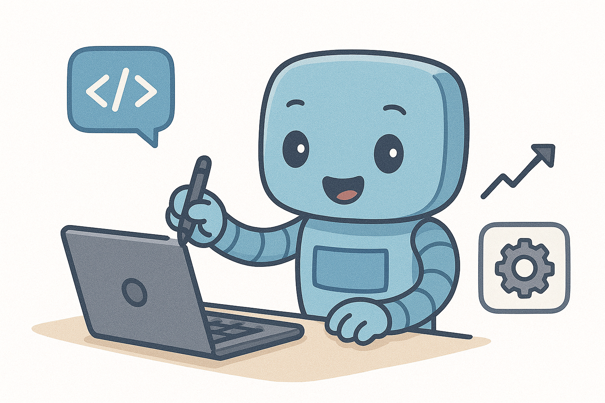

  

<h1 align="center">
  AI Dev Tools Zoomcamp: AI-Native Software Engineering
</h1>

  A free, hands-on course on using AI developer tools to build, test, deploy, extend, and audit software without losing engineering discipline.

  

  <a href="https://courses.datatalks.club/register/ai-dev-tools/">Register</a> |
  <a href="https://courses.datatalks.club/ai-dev-tools-2026/">Course Platform</a> |
  <a href="https://datatalks.club/slack.html">Join Slack</a> |
  <a href="https://app.slack.com/client/T01ATQK62F8/C09HWT76L95">Course Slack Channel</a> |
  <a href="https://t.me/aidevtoolszoomcamp">Telegram</a> |
  <a href="https://www.youtube.com/playlist?list=PL3MmuxUbc_hLuyafXPyhTdbF4s_uNhc43">YouTube Playlist</a> |
  <a href="https://datatalks.club/faq/ai-dev-tools-zoomcamp.html">FAQ</a>

  
  

## Quick Links

| Resource | Link |
| --- | --- |
| Register | [Sign up for the free 2026 cohort](https://courses.datatalks.club/register/ai-dev-tools/) |
| Start date | August 31, 2026 |
| Learn | [Course platform](https://courses.datatalks.club/ai-dev-tools-2026/) &middot; [Materials](https://github.com/DataTalksClub/ai-dev-tools-zoomcamp) &middot; [Videos](https://www.youtube.com/playlist?list=PL3MmuxUbc_hLuyafXPyhTdbF4s_uNhc43) |
| Course launch | [Read the launch article](https://aishippingblog.com/p/ai-dev-tools-zoomcamp-2026-starts) |
| Community | [Slack](https://datatalks.club/slack.html) &middot; [Course channel](https://app.slack.com/client/T01ATQK62F8/C09HWT76L95) &middot; [Telegram](https://t.me/aidevtoolszoomcamp) |
| Help | [Docs](https://datatalks.club/docs/courses/ai-dev-tools-zoomcamp/) &middot; [Logistics](https://datatalks.club/docs/courses/zoomcamp-logistics/) &middot; [FAQ](https://datatalks.club/faq/ai-dev-tools-zoomcamp.html) |

> [!NOTE]
> The 2026 materials are currently being finalized. The repository shows the direction for the next cohort, but some videos, homework, deadlines, project requirements, and module details may change before the cohort starts on August 31, 2026.

## About the Course

AI Dev Tools Zoomcamp is a free, practical course for developers and technical data professionals who want to learn disciplined AI-assisted software development.

The course is built around one core workflow:

> Give AI tools the right context, use them for the right job, review what they produce, test the result, and ship software with guardrails.

You will compare modern AI developer tools, build and deploy a full-stack application, operate it with observability and an agent-assisted incident response, and extend coding agents with MCP and reusable capabilities.

This is not a prompt-engineering-only course, and it is not a course about training models or building RAG systems. The focus is day-to-day software development with AI coding assistants, agents, tests, CI/CD, deployment, documentation, and review.

## Who Should Join

This course is for you if you:

- Already write basic code in Python, JavaScript, TypeScript, or a similar language.
- Want to use AI coding tools professionally, not only for isolated snippets.
- Want a repeatable workflow for planning, prompting, reviewing, testing, debugging, and shipping code.
- Care about maintainability, tests, deployment, documentation, and code review.
- Want to build a project that demonstrates practical AI-assisted development skills.
- Benefit from cohort deadlines, community support, peer review, and certificate eligibility.

The course is especially relevant for software engineers, ML engineers, MLOps engineers, AI engineers, data scientists, data engineers, analysts who write code, and technical students who want practical project experience.

This course is probably not the right fit if you have never programmed before, want a non-technical AI introduction, or mainly want model training, fine-tuning, LangChain, vector databases, or RAG.

## Prerequisites

You do not need prior AI tools experience.

You should have:

- Basic programming ability in Python, JavaScript, TypeScript, or a similar language.
- Comfort using the command line.
- Git and GitHub basics.

Helpful, but not required:

- Basic web development familiarity.
- Basic Docker familiarity.

Not required:

- Prior coding assistant or coding agent experience.
- A powerful machine or GPU.

## How to Take the Course

You can follow the course as part of the live cohort or use the materials self-paced.

| | Live Cohort | Self-Paced |
| --- | --- | --- |
| Start | August 31, 2026 | Anytime |
| Cost | Free | Free |
| Lectures | Pre-recorded | Pre-recorded |
| Homework | Graded | Available, but not scored |
| Leaderboard | Yes | No |
| Peer review | Yes | No |
| Certificate eligibility | Yes | No |
| Registration | [Sign up here](https://courses.datatalks.club/register/ai-dev-tools/) | Start from the repository |

> [!IMPORTANT]
> "Live cohort" does not mean mandatory live classes. Lectures are pre-recorded. Live cohort means shared deadlines, scored homework, leaderboard participation, peer review, community momentum, and certificate eligibility.

Self-paced steps:

1. Follow the materials in this repository.
2. Watch the videos in the [course playlist](https://www.youtube.com/playlist?list=PL3MmuxUbc_hLuyafXPyhTdbF4s_uNhc43).
3. Ask questions and share progress in [DataTalks.Club Slack](https://datatalks.club/slack.html).
4. Do the homework for practice and build a portfolio project.

## Syllabus

### [Module 1: AI-Native Developer Workflow](01-ai-native-workflow/)

Learn how to turn a vague product idea into specified, implemented, and independently verified software with coding agents. You define the requirements, make the key decisions, and review the results.

In this module, you'll:

* Refine a vague idea into a product specification and choose a technology stack you can review.
* Break the specification into a backlog of focused tasks with clear goals, acceptance criteria, constraints, and boundaries.
* Give coding agents durable context through `AGENTS.md` and supporting project documents.
* Define product manager, software engineer, and QA roles that separate task grooming, implementation, and independent verification.
* Use loop engineering to continue work until a checkable condition is met.
* Use graph engineering to orchestrate specialized agents across the backlog and return failed tasks to implementation.

After this module, you can design and run an AI-native development workflow that takes a product from an initial idea through implementation and independent QA while keeping human decisions and review central.

> Article: [AI-Native Development: Specifications, Loop and Graph Engineering](https://aishippingblog.com/p/ai-native-development-specifications)

### [Module 2: Build and Ship an AI-Assisted Full-Stack App](02-development/)

Build a full-stack application with AI coding assistants, replacing mocked components one at a time and verifying that the system works after each stage.

You will:

* Turn an application idea into a product specification with user stories, acceptance criteria, non-goals, and technical constraints.
* Build and validate an interactive frontend prototype with backend calls centralized in a mocked service layer.
* Define the expected backend behavior through an OpenAPI contract shared by the frontend and backend.
* Implement a modular FastAPI backend from the contract, initially using an in-memory store.
* Connect the frontend and backend, add authentication and real-time collaboration with WebSockets, and test the complete application flow.
* Replace temporary storage with SQLite and SQLAlchemy while keeping the database configuration portable.
* Add tests and reproducible commands for running the application locally.

After this module, you will have a working local full-stack application with a connected frontend and backend, real-time updates, persistent data, tests, and a clear API contract. In Module 3, you will containerize, test, and deploy it.

> Article: [Build and Ship a Full-Stack App with AI Coding Assistants](https://aishippingblog.com/p/build-and-ship-a-full-stack-app-with)

### [Module 3: Test, Containerize, and Deploy an AI-Assisted App](03-deployment/)

Take the application from your local machine to a public deployment, with automated tests and delivery checks that verify the complete system.

You will:

* Package the frontend and backend in a multi-stage Docker image, with the backend serving the compiled frontend.
* Replace SQLite with Postgres and run the application and database together with Docker Compose.
* Add integration tests that verify the frontend build, backend, and Postgres connection.
* Use Playwright to test the complete collaborative workflow across separate browser sessions.
* Deploy the containerized application to AWS with CloudFormation, or adapt the workflow to another container platform.
* Create a GitHub Actions pipeline that runs frontend and backend tests, builds the stack, and executes integration and end-to-end tests.
* Use OpenID Connect to deploy with restricted AWS permissions and verify each release through a health check.

After this module, you will have a public, containerized application backed by Postgres, with automated tests and a CI/CD pipeline that deploys changes only after the complete test suite passes.

> Article: [Deploy a Full-Stack App with AI Coding Assistants](https://aishippingblog.com/p/deploy-a-full-stack-app-with-ai-coding)

### [Module 4: DevOps and Observability for AI-Built Apps](04-devops/)

A deployed application can still fail silently. Add release controls and observability so you can detect user-impacting problems, investigate them with evidence, and start an AI-assisted response.

You will:

* Separate development and production environments, deploying every change to development before manually promoting it to production.
* Split the CI/CD process into build and deployment stages, store versioned images in a container registry, and promote the same tested image between environments.
* Instrument the backend with OpenTelemetry, including the service name, environment, and deployed version.
* Collect metrics, logs, and traces through an OpenTelemetry Collector using Prometheus, Loki, Tempo, and Grafana.
* Define application-specific metrics and build a dashboard that can be filtered by environment and deployed version.
* Create an actionable alert for sustained user impact, including the affected service, environment, version, owner, and dashboard.
* Start a headless coding agent when an alert fires so it can investigate the failure, reproduce it, and create a minimal tested fix.
* Introduce a reproducible bug to verify the complete path from failure and alert to automated investigation.

After this module, you will have separate development and production workflows, reproducible release artifacts, an observability stack, actionable alerts, and a proof-of-concept AI on-call responder.

> Article: [DevOps and Observability for an AI-Built App](https://aishippingblog.com/p/devops-and-observability-for-an-ai)

### [Module 5: Coding Agent Building Blocks: Reusable Skills and Specialized Subagents](05-agent-capabilities/)

Turn repeated workflows and project roles into reusable capabilities that coding agents can discover and apply when needed.

You will:

* Understand the difference between skills, subagents, and ordinary project documentation.
* Create discoverable skills with `SKILL.md`, frontmatter, supporting instructions, and scripts.
* Decide whether a skill should be available globally or only inside one project.
* Capture a completed workflow and your corrections as a reusable skill, then update it as the process improves.
* Use focused subagents to reduce context rot and separate implementation from independent review.
* Define reusable product manager, software engineer, and QA subagents with clear roles and boundaries.
* Use the main coding session as an orchestrator that moves tasks through grooming, implementation, and QA.
* Run independent tasks in parallel using isolated Git worktrees, controlled file ownership, and sequential merges.

After this module, you will have reusable skills, specialized subagent definitions, and an orchestration pattern for completing project work in isolated sequential or parallel workflows.

> Article: [Coding Agent Building Blocks: Reusable Skills and Specialized Subagents](https://aishippingblog.com/p/coding-agent-building-blocks-reusable)

> [!NOTE]
> Module 5 has no graded homework. It is assessed through the [module deliverable](05-agent-capabilities/#module-deliverable-agent-extension-pack) instead.

## Final Project

The [final project](project/) applies the course workflow to an end-to-end application of your own.

You will:

- Choose a problem and describe the expected system behavior
- Build a frontend
- Build a backend
- Define frontend/backend communication with an OpenAPI contract
- Add database or persistent storage
- Test the application
- Containerize the application
- Deploy it so others can try it
- Document how AI tools, prompts, workflows, agent instructions, MCP, or automation were used

For the live cohort certificate path, projects are evaluated through peer review. Learners must pass the final project and complete the required peer reviews.

## Certificate

Certificates are available during the live cohort for learners who complete the final project and the required peer reviews.

Homework helps you stay on track, but the certificate is based on the final project and peer review requirements. See [Certification](https://datatalks.club/docs/courses/zoomcamp-logistics/certification/) for the general certificate process.

Self-paced learners can use all materials for free, but certificate eligibility requires participation in a live cohort.

## Instructors

- [Alexey Grigorev](https://linkedin.com/in/agrigorev)
- [Bhavani Ravi](https://www.linkedin.com/in/bhavanicodes)

## Learner Stories

> This course fundamentally changed how I approach AI development. I moved from "building models" to designing AI-assisted systems that are faster to ship and easier to iterate on.
>
> During the course, I built a portfolio optimization tool, a full-stack application using ChatGPT, Lovable, and Antigravity, and a structured GitHub project with reproducible documentation.
>
> - [Yann Pham-Van](https://www.linkedin.com/in/chasseur2valeurs/), Freelance Data Scientist

> The course taught me how to use coding agents effectively, debug issues, and gave me exposure to MCPs, tools, and prompts. It helped me conceptualize any idea into a working prototype.
>
> - [Revathy Ramalingam](https://www.linkedin.com/in/revathy-ramalingam/), Senior Software Engineer at Yalabs Solutions

> During the course I built a Finnish learning website which helps English users practice reading, writing, listening, and speaking skills for the Finnish language.
>
> I used Antigravity with Gemini and Claude, a Context7 documentation MCP server, TypeScript, Python, Next.js, FastAPI, SQLite, and CI/CD with GitHub Actions.
>
> - [Kaiquan Mah](https://www.linkedin.com/in/kaiquan-mah), Data Scientist at Total eBiz Solutions

## Community and Support

### Slack

Join [DataTalks.Club Slack](https://datatalks.club/slack.html) and use the [#course-ai-dev-tools-zoomcamp](https://app.slack.com/client/T01ATQK62F8/C09HWT76L95) channel for course questions, troubleshooting, and discussion.

Before posting questions, please check:

- [Question guidelines](https://datatalks.club/docs/courses/zoomcamp-logistics/asking-questions/)
- [Community guidelines](https://datatalks.club/slack/guidelines.html)

### Announcements

Course announcements are posted in the [Telegram channel](https://t.me/aidevtoolszoomcamp). Telegram messages are also reposted to the course Slack channel.

### Learning in Public

Share your progress with the hashtag `#aidevtools` and tag Alexey Grigorev or DataTalksClub. Learning in public helps you stay accountable, meet other learners, and build visible proof of your work.

See the [learning in public guide](https://datatalks.club/docs/courses/zoomcamp-logistics/learning-in-public/).

## Sponsors

Interested in supporting DataTalks.Club and this course? Reach out to [alexey@datatalks.club](mailto:alexey@datatalks.club).

## FAQ

For the full list, see the [AI Dev Tools Zoomcamp FAQ](https://datatalks.club/faq/ai-dev-tools-zoomcamp.html).

### Is this course free?

Yes. The videos, materials, homework, and live cohort participation are free.

### Do I need AI experience?

No. Prior AI coding tool experience is not required. You should be able to write basic code and work with a project repository.

### Do I need to be a software engineer?

No. The course is also relevant for data scientists, ML engineers, MLOps engineers, data engineers, analysts who write code, and technical students. You do need basic programming ability.

### Are there live classes?

Lectures are pre-recorded. The live cohort adds deadlines, scored homework, a leaderboard, peer review, community support, and certificate eligibility.

### Can I take the course self-paced?

Yes. You can use the videos and repository materials anytime. Self-paced learners are not certificate-eligible unless they join a live cohort.

### Do I need a powerful computer or GPU?

No. A powerful machine or GPU is not required.

### Is this course about RAG or model training?

No. The course focuses on AI-assisted software development workflows: coding assistants, agents, MCP, testing, CI/CD, deployment, documentation, review, security, audit, and DevOps.

## About DataTalks.Club

  

  <a href="https://datatalks.club/">DataTalks.Club</a> is a global online community of data enthusiasts. It is a place to discuss data, learn, share knowledge, ask and answer questions, and support each other.

  <a href="https://datatalks.club/">Website</a> |
  <a href="https://datatalks.club/slack.html">Join Slack Community</a> |
  <a href="https://us19.campaign-archive.com/home/?u=0d7822ab98152f5afc118c176&id=97178021aa">Newsletter</a> |
  <a href="http://lu.ma/dtc-events">Upcoming Events</a> |
  <a href="https://www.youtube.com/@DataTalksClub/featured">YouTube</a> |
  <a href="https://github.com/DataTalksClub">GitHub</a> |
  <a href="https://www.linkedin.com/company/datatalks-club/">LinkedIn</a> |
  <a href="https://x.com/DataTalksClub">X</a>

Most DataTalks.Club activity happens in [Slack](https://datatalks.club/slack.html). We post updates there, discuss course questions, and help learners support each other.

At DataTalks.Club, we organize online events, community activities, and free courses. Learn more in the [DataTalks.Club docs](https://datatalks.club/docs/general/).
