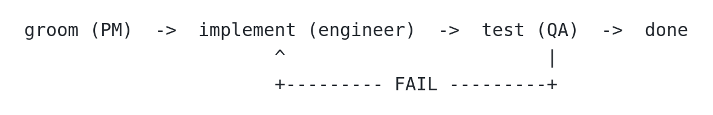

# AI-Native Development: Specifications, Loop Engineering, and Graph Engineering

This is the first article in a series based on
[AI Dev Tools Zoomcamp](https://github.com/DataTalksClub/ai-dev-tools-zoomcamp),
the free course we run at DataTalks.Club.

This year, I wanted to run an experiment and publish a series of course notes
as articles on Substack. I plan to publish one independent article per module,
starting with the first one: AI-native developer workflows.

Coding agents now write code faster than I can read it. 

When we give an agent a task, it can quickly implement it.
But if a task is vague, the agent fills the gaps with its own assumptions.
A weak agent that misunderstands us writes fifty lines of broken code. A strong
agent that misunderstands us creates eight files, wires them together, and adds
tests that pass. The code works, but it isn't what we needed.

We no longer spend most of our time typing. We spend it saying precisely what
we want and checking what came back.

In this article, I show how to make the request specific so the agents
don't need to guess. Then we decompose the request into tasks and assign them
to a product manager, a software engineer, and a QA engineer. Finally, we
implement all the tasks in a backlog through a loop.

We cover topics like:

- Spec-driven development
- Context engineering
- Loop engineering
- Graph engineering

We'll use a deliberately vague project idea: a tool for weekly feedback for
projects. It doesn't say who gives the feedback, who receives it, or what
"projects" means.

You can see the final result in the
[`retroloop` repository](https://github.com/alexeygrigorev/retroloop).

## Specs before code

We need to understand what we want to build before the agent produces the first
line of code. We have to think it through in detail and give explicit
instructions. If we do that, the agent will produce something close to what we
want.

We call this "spec-driven development". We start with the
specification, make sure it aligns with our vision, and only then
write the code from it.

In our example, "a tool for weekly feedback for projects", many things aren't
clear.

- Who are the users for this tool?
- What problem will they solve?
- How are they going to use it?

If we don't specify these things and give the idea directly to a coding agent,
it'll fill the gaps.

When I asked Claude Code to implement this project, the only prompt I gave was
"a tool for weekly feedback for projects". It came up with
[`weekly-feedback`](https://github.com/DataTalksClub/ai-dev-tools-zoomcamp/tree/main/01-ai-native-workflow/weekly-feedback),
a command-line tool for tracking weekly project status. It records wins,
issues, blockers, and next steps. It also created documentation and covered the
app with 62 tests, which all pass.


It all works perfectly, but that's far from what I needed.
I needed a web tool for a team retrospective that captures feedback
from teams in the form of "Start/Stop/Continue". It was my fault that I
didn't tell Claude that.

## Start in a chat assistant

Instead of giving a prompt directly to the coding assistant, I start in a chat
application and talk the idea through. I use ChatGPT in dictation mode for
this.

I begin with the same vague idea:

```text
I want to build a tool for weekly feedback for projects.

Help me set the scope for this project precisely. I want to brainstorm with you
and understand how the tool should work. Give me options.

Ask me one question at a time and keep your output short.
```

This way, we can use AI as our brainstorming partner and find out precisely
what we want:

- Who contributes feedback? All team members.
- What format do they use? Start/Stop/Continue.
- Is the feedback anonymous? Names appear by default, but contributors can
  choose to remain anonymous.
- What can people see before the reveal? Only their own cards.
- How does the facilitator reveal the feedback? All cards appear at the same
  time.
- What happens next? The team clusters the cards, then each person casts three
  votes for the topics to discuss and can give multiple votes to one topic.
- What does the team record? Decisions and action items from the discussion.
- Can the facilitator add a recording? They can upload audio, video, or a
  transcript after the meeting, but built-in recording isn't part of the first
  version.

When we finish, I ask for a file with all the specifications:

```text
Save everything to a markdown file that I can download.
```

Download the file and save it as `plan.md`.


## Bootstrapping a project

Create a project from this specification:

```bash
mkdir project-name
cd project-name

git init
```

Copy the `plan.md` file:

```bash
mkdir -p _docs
mv ~/Downloads/plan.md _docs/plan.md
git add _docs/plan.md
git commit -m "Add project plan"
```

You can find the
[`plan.md` file](https://github.com/alexeygrigorev/retroloop/blob/711c33cc5b6b/_docs/plan.md)
from this project in the Retroloop repository.

I try to commit as often as possible, after every meaningful decision. With
those commits, we can review what the agent changed. If something isn't working
well, we can easily return to the last good state.

## Choose the stack and architecture

During the brainstorming session, we didn't choose the tech stack.

Ask the coding agent to come up with several options:

```text
Read _docs/plan.md. Propose multiple options for the tech stack and
explain each option.

Don't write code yet.
```

It proposes multiple options and explains the tradeoffs of each one.

I choose Django because I know it well enough to review. In your case,
you can select any technology you're comfortable with. It's also okay not to
have a preference and to let the agent select what it thinks will work best.

## Turn the decisions into a backlog

Now that we've settled on the tech stack, we can ask the agent to decompose the
specifications into a backlog with tasks:

```text
Create a backlog with tasks in _docs/tasks.md.

Each task should be small enough to finish in one session, and
independent enough that I could hand it to someone who has not read
the others.

Use this template for each task:

## <number>. <title>
Goal: <one line>
Description: <two or three sentences on what the task involves>

The first task should be setting up an empty project with a passing test.

Don't write code yet.
```

It created these
[`tasks.md`](https://github.com/alexeygrigorev/retroloop/blob/711c33cc5b6b/_docs/tasks.md).

Review the tasks and ask the agent to merge tasks that are too small or split
tasks that don't fit into one session.
We want to create an MVP - the first version of the app. If something is out of scope for your
vision of the MVP, remove it.

When we're happy with the tasks, move them to a task tracker. I use GitHub
issues for that.

Ask the agent to do it:

```text
Create a public GitHub repo for this project.
Move each task from _docs/tasks.md into a GitHub issue.
```

For that to work, we need the `gh` CLI tool authenticated and the repo
connected to the GitHub remote.

From this point on, GitHub issues are the canonical tasks and the only active
backlog. We no longer need `_docs/tasks.md`.

You can see the project that came out of it here:
[`retroloop`](https://github.com/alexeygrigorev/retroloop).


## Context engineering

The repository has a backlog now. When we start a new session, however, the
agent doesn't know which task we mean. It must figure that out every time.

These details go in `AGENTS.md`, which coding agents like Codex or OpenCode read
when they start a new session.

Claude Code reads `CLAUDE.md`, while I use multiple coding assistants and want
my workflow to be tool-agnostic.

That's why I also create `CLAUDE.md` with a single line:

```markdown
@AGENTS.md
```

It tells Claude to read `AGENTS.md`.

This is called context engineering. With prompt engineering, we control one
message in one session. With context engineering, we control what agents know
when they start a new session and what information they can find while they
work. We include useful facts and working rules they would otherwise have to
rediscover.


## `AGENTS.md`

To make this context available in every new session, create `AGENTS.md`:

```text
Commands

- `uv sync` - install dependencies
- `uv run pytest` - the whole suite
- `uv run pytest tests/test_home.py` - one test file

Rules

- Dependencies are added in `pyproject.toml`. Do not add one without
  asking
- Commit regularly
```

## The other documents

In addition to `AGENTS.md`, I usually have a few other Markdown documents in
my projects.

The main one is `process.md`, which I use to describe how work is organized.
It could live inside `AGENTS.md`, but I keep it separate.

Create `_docs/process.md`:

```markdown
- Tasks are GitHub issues, one at a time
- Read the acceptance criteria before starting and before closing
- Commit regularly
```

As I continue working on a project, I may create other documents, such as:

- `testing-guidelines.md` for testing
- `design-system.md` so the UI doesn't drift every session
- `api.md`, which describes what the API should look like

I keep them together in `_docs/` and link them from `AGENTS.md`:

```markdown
Documents

- `_docs/process.md` - how work is organized
- Before writing tests, read `_docs/testing-guidelines.md`
- For anything touching the UI, read `_docs/design-system.md`
```

The agent reads `AGENTS.md` at the start of every session, so it knows where to
find the process, testing, and design rules if it needs them.

This way, it will load the design system only for a UI task and the
testing guidelines only for a testing task.
By loading each document only when it's relevant, we keep
`AGENTS.md` short while we continue adding written context to the project.

These documents are living documents, and I update them often. If I need to
correct an agent during a coding session, I can ask it to modify the documents.
Next time, it knows what I need, so I don't have to correct it again.

You can use a prompt like this:

```text
Based on the corrections I made, find the relevant documents
and update them.

Commit the current work before changing the documents.
```

## Bootstrap the first task

With `AGENTS.md` and `process.md` in place, we can start a new session and ask
the agent to implement the first task:

```text
Implement task 1.
```

For this project, the agent creates the Django app, dependencies, and a
passing test.


## Grooming: the product manager agent

We have a backlog of tasks, but they're not precise enough.

We discussed this problem already: if the task isn't specific, the agent
will fill in the gaps during implementation. We risk spending time
and tokens on something we don't need.

Instead, we should ask the AI assistant to fill these gaps before writing any
code. Then we review the specification, correct it, and give it to the coding
agent to implement.

This process is called "grooming": we groom a task to make it more specific.
Then an engineer can implement it without asking a single question.

In real teams, product managers usually do this work. Here we'll create a team
of agents, and the first role we'll define will be a PM.

Create a document:

```text
_docs/team/
  pm.md
```

Inside, write the description for the product manager agent:

```markdown
You're a Product Manager

You groom a task before anyone implements it.

- Read the issue as written
- Rewrite it using the template in `_docs/task-template.md`
- Make the acceptance criteria checkable - someone should be able to
  point at the screen and say yes or no
- Think about the edge cases the person who filed it did not consider
- Do not write any code

Definition of done:

- The issue has all four sections filled in
- Every acceptance criterion can be checked by looking at the result
- Everything moved out of scope links to a follow-up issue
- An engineer who has never spoken to you could implement it from the
  issue and the documents it links

If something does not belong in this task, do not silently drop it.
File a follow-up issue and list it under out of scope with a link to
that issue, so it is clear what was moved and where it went.
```

A groomed task has four sections:

1. Goal - one or two sentences on what should be true afterwards.
2. Acceptance criteria - checkable statements.
3. Out of scope - what this change must not do.
4. Constraints - files it should stay inside, libraries it should or
   shouldn't use, prior decisions it has to follow.

We save the issue template as `_docs/task-template.md`:

```markdown
## Goal

One or two sentences on what should be true when this is done.

## Acceptance criteria

- [ ] A statement you can check by looking at the result
- [ ] One line per case, including the awkward ones

## Out of scope

- Something that does not belong in this task, moved to #TASK-NUMBER

## Constraints

- Files this should stay inside
- Libraries to use
- Guidelines to follow
```

We'll need to groom every task, so we'll add it to `process.md`:

```markdown
Roles

- PM - grooms a task before anyone implements it, follows _docs/team/pm.md
```

We can now start a new session and ask the agent to groom an issue:

```text
Groom issue #4
```

After it finishes, review the result.

We can catch a misunderstanding most cheaply while grooming: the issue is a
paragraph, and correcting it costs one sentence. If we catch the same
misunderstanding after implementation, we need a rewrite.


## Loop engineering

After grooming one issue, we can ask the agent to groom the rest:

```text
Groom all GitHub issues. Process one issue at a time.
```

This will mostly work, but the agent may eventually stop. It might say, "I've
groomed issues 1, 2, and 3. Do you want me to proceed?"

The answer is almost always "yes", but the agent has stopped and is waiting for
us to say that explicitly. In many cases, I want the agent to continue
automatically.

To do it, we can give the agent a goal:

```text
/goal groom all issues
```

The `/goal` command will prompt the agent to continue, so we won't need to do
it manually. Instead, we delegate that responsibility to the harness: the
system around an agent, such as Claude Code or Codex. When the agent stops, the
harness checks whether the condition has been met. If it hasn't, the harness
resumes the work.


This approach is called "loop engineering". It's similar to a `while` loop:
we repeat the work until a condition is met.

With loop engineering, the system runs a coding agent repeatedly instead of
having us drive it manually, prompt by prompt.

There are multiple "engineering" levels when we work with coding agents:

- Prompt engineering - what we say when we interact with the agent
- Context engineering - what the agent knows before it starts and what it can
  get during the session
- Loop engineering - when it stops working
- Graph engineering - who does what when there's more than one agent (we'll
  discuss it later)

In June 2026, Addy Osmani published the
[Loop Engineering essay](https://addyo.substack.com/p/loop-engineering)
that gave it a name, and Peter Steinberger compressed the idea into one
sentence:

> [stop prompting your agents and start designing the loops that
> prompt them.](https://x.com/steipete/status/2063697162748260627)

A loop needs a stop condition: a checkable statement that tells the harness
when to stop. For `/goal groom all issues`, the stop condition is "all issues
are groomed". After each agent run, the harness checks whether that condition
is true and resumes the agent if it isn't.

The stop condition must be something the model can evaluate. "All issues are
groomed", "all tests pass", and "no file is over 200 lines" are checkable, but
"make the code better" isn't. If the stop condition isn't checkable, the agent
can stop too early or run forever.

Claude Code and Codex provide the `/goal` loop by default.
If your harness doesn't provide it, you can implement it yourself
using stop hooks.


## Implementation: the software engineer agent

After grooming the issue, we can give it to a software engineer, the agent who
will write the code.

Define the second role:

```text
_docs/team/
  software-engineer.md
```

Put this definition inside:

```markdown
You're a Software Engineer

You implement one groomed task at a time.

- Read the issue and implement what it describes
- Implement against the acceptance criteria, do not change them
- Stay inside the files and constraints the issue names
- Write tests for what you built
- Do not close the issue
- Commit regularly

Definition of done:

- Every acceptance criterion in the issue is implemented
- Tests are written for the new behaviour, and the whole suite passes
- The work is committed
- The issue is still open, with a comment saying what you did

If an acceptance criterion is wrong, impossible, or contradicts
another one, create a comment on the issue about it.
```

Add one more line to `process.md`:

```markdown
Roles

- PM - grooms a task before anyone implements it, follows _docs/team/pm.md
- Engineer - implements one groomed task, follows _docs/team/software-engineer.md
```

Then ask the agent to implement a task in a fresh session:

```text
Implement issue #2
```

The engineer stops when the code is written and its own tests pass. It's still
too early to say that the task is properly implemented, so we need to test it.

## Testing: the QA engineer agent

When the same agent writes and judges the code, it's grading its own homework.

If we ask, "Is this correct?" we'll get a definite "yes", but the agent might
have missed many edge cases.

In the real world, we ask other people to validate our work. We have code
reviews, and many teams have designated QA engineers whose focus is making
sure the code is reliable.

That's why we'll also add a QA engineer to our team.

Add the third role:

```text
_docs/team/
  qa-engineer.md
```

The description:

```markdown
You're a QA Engineer

You check finished work against the issue that specified it.

- Read the acceptance criteria from the issue
- Check each one against what the code actually does
- Run the tests, and say which ones you ran
- Look for the cases the criteria describe but the tests do not cover
- Do not fix anything you find. Report it by creating a comment

Your output is a verdict: PASS or FAIL. It is FAIL if a single
acceptance criterion fails. Post it as a comment on the issue:

## QA: FAIL

- [x] A visitor can create an account with a username and password - PASS
- [ ] A duplicate username shows a visible error - FAIL
      Submitted an existing username and received an unhandled error

Tests: `uv run pytest`, 18 passed, 0 failed

Definition of done:

- The comment starts with PASS or FAIL
- Every acceptance criterion has a verdict against it
- Every FAIL says what you did and what happened
- The test command and its result are included
- Nothing in the code was changed

Ignore what the implementation says it does. Only the acceptance
criteria and the running code count.
```

Note: you may need to adjust this role for your project if you don't use `uv`
and `pytest`.

And the last line in `process.md`:

```markdown
Roles

- PM - grooms a task before anyone implements it, follows _docs/team/pm.md
- Engineer - implements one groomed task, follows _docs/team/software-engineer.md
- QA - checks the result against the acceptance criteria, follows _docs/team/qa-engineer.md
```

Then, in a new session, ask:

```text
Test issue #2
```

If we get a `PASS`, that's great. If we get a `FAIL`, that's also useful:
we caught a regression. So we start a new engineer session, use the QA comment
as input, and ask the engineer to fix it. We iterate until QA says `PASS`.


## Graph engineering

We have three roles:

- Product manager grooms an issue
- Software engineer implements it
- QA engineer tests it, outputs `PASS` or `FAIL`

If QA says `FAIL`, the engineer will need to reimplement it. Otherwise, the task
is done.

We can visualize this process as a graph:



If we have an orchestrator that launches these agents automatically instead of
us doing it manually, we get "graph engineering". We define a graph with
specialized agents as nodes and describe how the work moves from one to
another.

The earliest explicit use of the term I found in the article from Josh C. Simmons (July 4, 2026): [The Graph Engineering phase](https://www.drjoshcsimmons.com/writing/we-are-entering-the-graph-engineering-phase).

Peter Steinberger sparked a wider discussion in a
[July 18 post](https://x.com/steipete/status/2078277297791189132) by asking
whether the conversation had shifted from loops to graphs.
A few hours later, Hamel Husain used
["graph engineering"](https://x.com/HamelHusain/article/2078346425621237935)
in an article headline.


Hamel put just a GIF saying "stop it" in the article,
but people liked the term and started using it for multi-agent orchestration.

I wouldn't call it a new idea, though, and loop engineering is definitely not
dead. Even with graphs, we still need a loop to drive the work and orchestrate
it across multiple agents with different roles.

## The orchestrator

To implement it, we need an orchestrator.

Describe it in `process.md`:

```markdown
Orchestrator

The main session is the orchestrator. It launches the PM, the engineer
and QA as subagents. It does not groom, implement or test itself.

Lifecycle

1. Pick the next open issue from the backlog
2. PM grooms it
3. Engineer implements it
4. QA verifies it
5. On FAIL, back to step 3 with the QA comment as input
6. On PASS, close the issue
7. Repeat until the backlog is empty

Rules

- Do not skip step 2
- The engineer does not close the issue
- QA does not fix the code, only outputs PASS or FAIL
- The orchestrator closes the issue only after QA outputs PASS
```

We can now start a fresh session and launch the loop:

```text
/goal work through the backlog
```

The agent reads `AGENTS.md`, finds `process.md`, follows the lifecycle,
and dispatches the agents according to the documents in `_docs/team/`.

Because we combine it with a goal, the orchestrator runs until the condition
holds.

You can see the result in [`retroloop`](https://github.com/alexeygrigorev/retroloop).

Note: this approach takes significantly more time and tokens than a direct loop
with only a software engineer. In many cases, you don't need this complexity.
Often, a simple prompt or loop is enough.

I've followed this approach on many projects, including the
[AI Shipping Labs website](https://aishippinglabs.com/).

I describe it in
[I Built an AI Agent Team for Software Development](https://alexeyondata.substack.com/p/i-built-an-ai-agent-team-for-software).
Here, I distill that article into a tutorial.

## Next in the series

We have now finished the first module.

In later modules, we build on the same workflow:

- Building and shipping a full-stack app end to end: spec to frontend,
  backend, tests, Docker, deployment and CI/CD
- Coding agent capabilities: MCP, skills, plugins, hooks and custom
  agents
- AI for security, audit and DevOps
- Taking a project of your own from an empty folder to something
  running

You can find other materials for the course in the course repo:
[AI Dev Tools Zoomcamp](https://github.com/DataTalksClub/ai-dev-tools-zoomcamp).

It's free.
