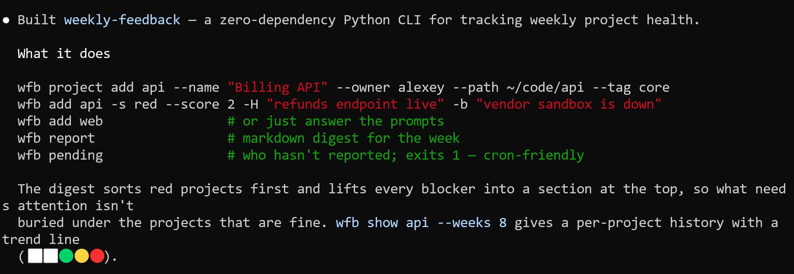
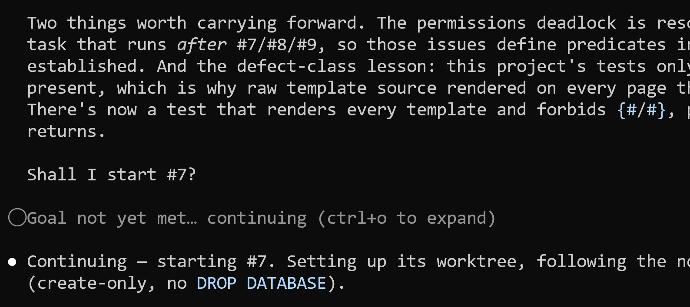

# AI-Native Development: Specifications, Loop and Graph Engineering

This is the first article in a series based on
[AI Dev Tools Zoomcamp](https://github.com/DataTalksClub/ai-dev-tools-zoomcamp),
the free course we run at DataTalks.Club.

This year I wanted to do an experiment and publish a series of course notes as articles on Substack. My plan is to have one per module, and each one should be independent from others. I start with the first one: AI-native developer workflows.

Coding agents now write code faster than I can read it. 

When we give an agent a task, it can quickly implement it.
But if a task is vague, the agent fills the gaps with its own assumptions.
A weak agent that misunderstands us writes fifty lines of broken code. A strong
agent that misunderstands us creates eight files, wires them together, and adds
tests that pass. The code works, but it isn't what we needed.

Typing is no longer the bottleneck. Saying precisely what we want, and
checking what came back, is.

In this article, I show how to make the request specific, so the agents
don't need to guess. Then we decompose the request into tasks, and assign each one to a team of agents: a product manager, a software engineer and a tester. 
Finally, we implement all the tasks in a backlog through a loop.

We cover topics like:

- Spec-driven development
- Context engineering
- Loop engineering
- Graph engineering


## Running example

We start with a deliberately vague project idea: a tool for weekly feedback
for projects. It doesn't say who gives the feedback, who receives it, or what
happens next.

We work out what the product should be while writing the specification with
ChatGPT. Then we compare it with what Claude Code builds from the original
one-line description.


## Specs before code

We need to understand what we want to build before the agent produces
the first line of code. So we think it through in detail, and give
explicit instructions. If we do that, the agent will produce something close
to what we want.

We call this spec-driven development. We start with the
specification, treat it as the canonical version, and write the code
from it.

There are two levels of specifications:

- Project-level - what the project is. We create it once and don't
  modify often.
- Feature-level - what a change should do and how we'll know it
  worked, written per task and thrown away after.

In my case the project level specs live in `plan.md`, `process.md` and
`AGENTS.md`, in a `_docs` folder. The feature level specs are tasks in
a task tracking system, usually GitHub issues.

## Start in a chat assistant

Don't start the coding session with a coding agent. Coding agents
write code, but we don't know what we want yet, so we'll only waste
time and tokens.

Instead, open a chat assistant and talk the idea through. I use ChatGPT in
dictation mode for this. It's faster than typing and it keeps me in the mode
of explaining rather than specifying.

In that conversation, cover:

- what the thing is
- who it's for
- what it should do
- what it shouldn't do
- what we're unsure about

Also ask it about what's already out there, so we don't spend a
weekend rebuilding something that exists.

As the conversation progresses, we get a clearer vision of what we want to
build.

At the end, ask:

```text
Save this to a markdown file I can download.
```

I save the answer as the spec, which usually covers:

- what the project is, in a couple of sentences
- who it's for, and what they're trying to do
- what it doesn't do
- the stack, and the constraints it has to live inside
- a rough architecture: the main pieces and how they relate

For the retrospective app, we turn "weekly feedback for projects" into a
specific flow. Team members submit anonymous Start/Stop/Continue cards, the
facilitator reveals them together, the group clusters and votes on them, and
the meeting ends with action items. We also decide what each role can see and
which features don't belong in the first version.

I describe the same planning process in more detail in the
[SQLiteSearch](https://alexeyondata.substack.com/p/how-i-built-sqlitesearch-a-lightweight) article.

First, I had a long chat to get the design straight. Then I downloaded the
[`plan.md`](https://github.com/alexeygrigorev/sqlitesearch/blob/main/plan.md)
file and started coding. It explained what the library is and how it differs
from [minsearch](https://alexeyondata.substack.com/p/minsearch-the-small-search-library).
It also covered when to use each library and how SQLiteSearch is organized.

## A working answer to the wrong question

Now that we know what the retrospective app should do, we can test what happens
when we withhold that context.

I give Claude Code only the original idea:

```text
Implement a tool for weekly feedback for projects.
```

The agent writes a complete zero-dependency Python CLI. You can register
projects, record their status, generate a Markdown digest, and list the people
who haven't reported. It also writes tests and documentation.



You can read and run the
[`weekly-feedback` source](../01-ai-native-workflow/weekly-feedback/).
The code works, but I had a team retrospective app in mind rather than a
personal status-reporting CLI. Claude Code had no way to know that because the
prompt said nothing about teams or anonymity. It also omitted
Start/Stop/Continue cards, clustering, voting, and action items.

To build the intended product, we give the coding agent the spec instead. The
finished project is
[`retroloop`](https://github.com/alexeygrigorev/retroloop), a Django app for
weekly feedback cycles and the retrospectives that follow them. Its
[issues](https://github.com/alexeygrigorev/retroloop/issues) also show the
backlog, grooming, implementation, and QA history.

## Bootstrapping a project

We have a spec, and now we turn it into a repo with a backlog the
agent can work through. You can compare these steps with `retroloop`'s
[`plan.md`](https://github.com/alexeygrigorev/retroloop/blob/main/_docs/outdated/plan.md),
[`architecture.md`](https://github.com/alexeygrigorev/retroloop/blob/main/_docs/outdated/architecture.md),
and
[`tasks.md`](https://github.com/alexeygrigorev/retroloop/blob/main/_docs/outdated/tasks.md).

Make a folder, initialise git, and drop the spec in.

```bash
mkdir project-name && cd project-name
git init
mkdir _docs
mv ~/Downloads/plan.md _docs/plan.md
```

Open the coding agent in that folder.

If we didn't decide on the tech stack in the previous conversation, we need
to do it now.

If the plan doesn't name a stack, the agent will pick the technologies. That
works when we don't care about the implementation, but I still suggest using
something familiar.

Ask the agent to compare the options:

```text
Read plan.md. Propose multiple options for the tech stack and explain each option.

Do not write any code yet.
```

Then break the plan into tasks:

```text
Propose a backlog of tasks. Create a document `tasks.md`

Each task should be small enough to finish in one session, and
independent enough that I could hand it to someone who has not read
the others.

Use this template for each task:

## <number>. <title>
Goal: <one line>
Description: <two or three sentences on what the task involves>

Make the first task setting up an empty project, with a
test that runs and passes.

Do not write any code yet.
```

Review a few tasks before creating the backlog. Merge tasks that are too small,
split tasks that don't fit one session, and move unrelated work out of scope.

When the tasks are ready, save them in a task tracker. I usually use GitHub
issues.

Give the agent this instruction:

```text
Create a GitHub issue for each task.
```

For that to work, we need the `gh` CLI tool authenticated.

We can then initialize the project:

```text
Do task 1: set up an empty project on the chosen stack - the folder
layout, the dependencies, and one test that runs and passes. No
features yet.
```

From here on, we start every task from a project that already runs. A failing
test means the task broke something rather than that nothing exists yet.


## Context engineering

The repo has a backlog now, but the agent that works through it still
starts every session knowing nothing about the project.

When we engineer context, we make the project understandable to an agent before
the agent starts working. This isn't
"writing better prompts". A prompt is one message in one session, while
context is everything the agent needs to know before it starts the
task.

We can put these details in `AGENTS.md`. Coding agents read this plain
Markdown file from the repo root when they start.

Claude Code reads `CLAUDE.md`, while Codex and most other tools read
`AGENTS.md`. I use multiple coding assistants.

My `CLAUDE.md` contains one line:

```markdown
@AGENTS.md
```

## `AGENTS.md`

We don't describe the project in `AGENTS.md`. The description belongs
in the README, which the agent can read anyway.

What we put there:

- Commands, especially the non-obvious ones - how to run a single test,
  not just the whole suite
- Tooling rules - which package manager, which command form
- Constraints and cautions - what doesn't exist, and what must never
  be printed or committed
- Pointers to the real documents - where the spec, the process and the
  tasks live
- Corrections we got tired of repeating - anything we have typed more
  than once

It collects the things the agent got wrong, plus the things it can't
guess or would spend time discovering. Keep it short.

For example:

```markdown
Commands

- `npm run dev` - dev server
- `npm test` - the whole suite
- `npm test -- cost` - one test file
- `npm run lint` - lint and format check, run it before committing

Rules

- Cost and rate calculations go in `src/cost/`, not in components
- Money is integer cents everywhere, never floats
- All time comes from `src/clock.ts`, do not call `Date.now()` anywhere
  else
- Salaries are entered as annual figures, the per-second rate is derived
- Tests live next to the code they cover, as `*.test.ts`
- Do not add dependencies without asking
- Do not edit `src/generated/`, it is rebuilt from the schema
- Commit regularly
```

I avoid markup there like sections, bold formatting, or tables. They
don't add any value and only result in higher token consumption.

Don't add these things to `AGENTS.md`:

- Transient task state. "Currently working on the cost calculation" is
  a session note, not a project fact.
- Anything secret. Keys, tokens, internal URLs, customer names. This
  file is read by tools, copied into contexts and committed to git. Use
  `.env` for that.
- Long explanations.

If `AGENTS.md` becomes larger than a couple of screens, move parts of it into
separate Markdown documents.

## The other documents

In addition to `AGENTS.md`, I usually have a few other markdown documents in 
my projects. 

I use `process.md` to describe how work is done in the project. It could live
inside `AGENTS.md`, but I keep it separate.

We start with a short version:

```markdown
- Tasks are GitHub issues, one at a time
- Read the acceptance criteria before starting and before closing
- Commit regularly
```

As I continue working on a project, I create a separate document for
each thing we need to explain over and over again.

In my projects I often have

- `testing-guidelines.md` for testing
- `design-system.md` so the UI doesn't drift every session
- `setup.md`
- `api.md`

I keep them together in `_docs/` and link them from `AGENTS.md`:

```markdown
Documents

- `_docs/process.md` - how work is organized
- Before writing tests, read `_docs/testing-guidelines.md`
- For anything touching the UI, read `_docs/design-system.md`
```

The agent reads `AGENTS.md` at the start of every session, so it knows where to
find the process, testing, and design rules.

It loads the design system only for a UI task and the testing guidelines only
for a testing task. By loading each document only when it's relevant, we keep
`AGENTS.md` short while the project's written context keeps growing.


## Grooming: The product manager agent

We have a backlog of tasks, but they're not precise enough.

Next, we "groom" the tasks, or make them more specific.
When we groom a placeholder task, we turn it into something an engineer can
implement without asking a single question.

Product managers usually do this work, so we'll define that role for our
agent team.

Create a document for the role:

```text
_docs/team/
  pm.md
```

Inside, write the description:

```markdown
You're a Product Manager

You groom a task before anyone implements it.

- Read the issue as written
- Rewrite it using the template in `_docs/task-template.md`
- Make the acceptance criteria checkable - someone should be able to
  point at the screen and say yes or no
- Think about the edge cases the person who filed it did not
- Do not write any code

Definition of done:

- The issue has all four sections filled in
- Every acceptance criterion can be checked by looking at the result
- Everything moved out of scope links to a follow-up issue
- An engineer who has never spoken to you could implement it from the
  issue alone

If something does not belong in this task, do not silently drop it -
file a follow-up issue, and list it under out of scope with a link to
that issue, so it is clear what was moved and where it went.
```

The PM needs a structure to fill in so every groomed issue looks the same.

A groomed task has four sections:

1. Goal - one or two sentences on what should be true afterwards.
2. Acceptance criteria - checkable statements.
3. Out of scope - what this change must not do.
4. Constraints - files it should stay inside, libraries it should or
   shouldn't use, prior decisions it has to follow.

We save that as `_docs/task-template.md`:

```markdown
## Goal

One or two sentences on what should be true when this is done.

## Acceptance criteria

- [ ] A statement you can check by looking at the result
- [ ] One line per case, including the awkward ones

## Out of scope

- Something that does not belong in this task, moved to #12

## Constraints

- Files this should stay inside
- Libraries it may not add, patterns it must follow
```

Because we groom every task, let's add that work to `process.md`:

```markdown
Roles

- PM - grooms a task before anyone implements it, follows _docs/team/pm.md
```

Let's work through an issue:

```text
Groom issue #4
```

Read the result before moving on.

We can catch a misunderstanding most cheaply while grooming: the issue is a
paragraph, and correcting it costs one sentence. The same
misunderstanding found after implementation costs a rewrite, and found
after release costs considerably more.

Check that the goal matches what we actually wanted, that every
acceptance criterion is something we could check, and that nothing
important got scoped out. If the groomed issue surprises us, fix it
now.

## Implementation: The software engineer agent

After grooming the issue, we give it to a software engineer.

Define the second role next to the first:

```text
_docs/team/
  pm.md
  software-engineer.md
```

`_docs/team/software-engineer.md`:

```markdown
You're a Software Engineer

You implement one groomed task at a time.

- Read the issue and implement what it describes
- Implement against the acceptance criteria, do not change them
- Stay inside the files and constraints the issue names
- Write tests for what you built
- Do not close the issue
- Commit regularly

Definition of done:

- Every acceptance criterion in the issue is implemented
- Tests are written for the new behaviour, and the whole suite passes
- The work is committed
- The issue is still open, with a comment saying what you did

If an acceptance criterion is wrong, impossible, or contradicts
another one, create a comment on the issue about it.
```

Add one more like to `process.md`:

```markdown
Roles

- PM - grooms a task before anyone implements it, follows _docs/team/pm.md
- Engineer - implements one groomed task, follows _docs/team/software-engineer.md
```

Then, in a fresh session:

```text
Implement issue #4
```

Ask the agent to implement the issue in small changes and commit after each
major step. Frequent commits give us a simple way to go back. Rewinding five
minutes of work is easy, while re-creating an hour of work isn't.

The engineer stops when the code is written and its own tests pass.
That's not the same as the task being done.

## Testing: The QA engineer agent

An agent that writes the code and then judges this code is grading its own homework.

If we ask "is this correct?" we'll get "yes," but the agent might have missed
many edge cases.

We test it in a separate session, as a QA engineer would.

Add the third role:

```text
_docs/team/
  pm.md
  software-engineer.md
  qa-engineer.md
```

The description:

```markdown
You're a QA Engineer

You check finished work against the issue that specified it.

- Read the acceptance criteria from the issue
- Check each one against what the code actually does
- Run the tests, and say which ones you ran
- Look for the cases the criteria describe but the tests do not cover
- Do not fix anything you find. Report it by creating a comment

Your output is a verdict: PASS or FAIL. It is FAIL if a single
acceptance criterion fails. Post it as a comment on the issue:

## QA: FAIL

- [x] Salary is entered as an annual figure - PASS
- [ ] Removing an attendee stops their cost accruing - FAIL
      Removed someone mid-meeting, the total kept rising

Tests: `npm test`, 14 passed, 0 failed

Definition of done:

- The comment starts with PASS or FAIL
- Every acceptance criterion has a verdict against it
- Every FAIL says what you did and what happened
- The test command and its result are included
- Nothing in the code was changed

Ignore what the implementation says it does. Only the acceptance
criteria and the running code count.
```

And the last line in `process.md`:

```markdown
Roles

- PM - grooms a task before anyone implements it, follows _docs/team/pm.md
- Engineer - implements one groomed task, follows _docs/team/software-engineer.md
- QA - checks the result against the acceptance criteria, follows _docs/team/qa-engineer.md
```

Then, in a new session:

```text
Test issue #4
```

If we get a `PASS`, it's great. If we get a `FAIL`, it's also good: 
we caught a regression. So we get back as a new engineer session, use 
the QA comment as the input, implement it, and iterate until QA says
`PASS`.


## Loop engineering

So far we have typed every prompt ourselves, running three sessions per
task. That's the right way to learn it, but it doesn't scale to many
issues.

When we engineer a loop, we design a system that runs a coding agent
repeatedly, instead of driving the agent prompt by prompt. The "system"
is the harness that controls the agent, plus whatever we wrap around
it. It decides what the agent picks up next, checks the result, and
decides whether to go again.

It's usually presented as one step on a ladder:

- Prompt engineering - what we say in one message
- Context engineering - what the agent knows before it starts
- Loop engineering - how often it runs, on what, and when it stops
- Graph engineering - who does what, when there's more than one agent

In June 2026 Addy Osmani published the
[Loop Engineering essay](https://addyo.substack.com/p/loop-engineering)
that gave it a name, and Peter Steinberger compressed the whole idea
into one sentence:

> stop prompting your agents and start designing the loops that
> prompt them.

The simplest useful loop is one command:

```text
/goal all tests pass
```

The agent works, runs the suite, and reads the failures. It works again
and stops when the suite is green or it hits the turn limit. We're not
in that cycle.

Something more realistic:

```text
/goal refactor src/cost so no file is over 200 lines, tests stay green
```

The stop condition has to be something a model can evaluate. "All tests
pass" is checkable, and so is "no file over 200 lines". "Make the code
better" isn't, so the agent can run forever, or stop too early.

Many harnesses ship these primitives: Claude Code has `/goal` and
`/loop`, while Codex has `/goal`.

If our harness doesn't provide them, we can build them:

- Stop hooks. A hook that fires when the agent finishes a turn can
  check a condition and prompt it again, which is how we implement
  `/goal`.
- Scheduled pings into a tmux session. If the agent is running in tmux,
  we can send keystrokes to that session on a timer, which is how we
  implement `/loop`.


## Graph engineering

We have three roles and a way to run tasks in a loop, but we're still
moving manually between the roles. We read the QA verdict and decide
whether it goes back to the engineer or we pick up the next task.

When we engineer a graph, we structure work across specialized agents. We
define each agent's responsibility and the order in which they work. We also
define how they pass results between roles.

We can draw this workflow as a graph. Each agent is a node, each handoff is an
edge, and the connections determine how the team works.

The term appeared on X around 18 July 2026, a month after loop
engineering, under the headline "Loop Engineering Is Dead". To me it
makes little sense as a new idea. People have been building
multi-agent systems and state machines for a long time, and
specialized workers passing work between them isn't new.

In the same discussion, people who build agent-orchestration tools said the
term was being used loosely, and they were right. Loop engineering isn't dead
either because we still need a way to run our tasks. We add roles on top of
that loop.

And what we built so far is already a graph:

```text
groom (PM)  ->  implement (engineer)  ->  test (QA)  ->  done
                       ^                        |
                       +--------- FAIL ---------+
```

The graph has three nodes. When QA returns `FAIL`, the orchestrator sends the
issue back to the engineer for another pass. Each role has its own instructions
and definition of done, while one role's output becomes another's input.

The agents hand off an issue rather than a conversation. Because the issue
includes the required context, each node can start as a separate session.

## The orchestrator

We have acted as the orchestrator so far. We pick the next issue, dispatch each
role in order, read the verdict, and route the issue. The main session can do
this work and leave grooming, implementation, and testing to its subagents.

In `process.md`, we have only listed the roles, so we now add the sequence and
name the orchestrator.

Add these sections:

```markdown
Orchestrator

The main session is the orchestrator. It launches the PM, the engineer
and QA as subagents. It does not groom, implement or test itself.

Lifecycle

1. Pick the next open issue from the backlog
2. PM grooms it
3. Engineer implements it
4. QA verifies it
5. On FAIL, back to step 3 with the QA comment as input
6. On PASS, commit and close the issue
7. Repeat until the backlog is empty

Rules

- One issue at a time
- Do not skip step 2, even when the task looks obvious
- The engineer does not close the issue, QA does not fix the code
- Do not commit until the tests pass
```

This process file defines three roles, an orchestrator, the lifecycle, and its
rules. In larger projects, I also specify which agent may commit and what a
reviewer must run before approving. I name known failure modes too, such as
skipping review because a task looked small.

We can now run the backlog:

```text
/goal work through the backlog
```

The agent reads `AGENTS.md`, finds `process.md`, follows the lifecycle,
and dispatches the roles it finds in `_docs/team/`. Every piece of that
sentence is something we built earlier.



The orchestrator continues until it meets the backlog-level goal, and its
commits and issue discussions remain visible in
[`retroloop`](https://github.com/alexeygrigorev/retroloop).

An agent can spend hours on a backlog-level goal and use several times more
tokens than direct implementation. The PM grooms each issue, the engineer
implements it, and QA tests it. A failed QA verdict adds another implementation
pass.

So if someone asks about graph engineering: it's several agents with
defined roles passing work to each other. The term
is from July 2026, but people have worked this way for much longer. It works
because we explicitly define the roles and lifecycle, then write the
specifications before we implement them.


## Next in the series

We have now finished the first module.

In later modules, we build on the same workflow:

- Building and shipping a full-stack app end to end: spec to frontend,
  backend, tests, Docker, deployment and CI/CD
- Coding agent capabilities: MCP, skills, plugins, hooks and custom
  agents
- AI for security, audit and DevOps
- Taking a project of your own from an empty folder to something
  running

If you'd rather do the course than read it, the materials, the
homework and the next cohort are here:
[AI Dev Tools Zoomcamp](https://github.com/DataTalksClub/ai-dev-tools-zoomcamp).
It's free.

My own multi-agent setup runs the same three roles across five real projects.
It also adds an on-call agent that watches CI:
[I Built an AI Agent Team for Software Development](https://alexeyondata.substack.com/p/i-built-an-ai-agent-team-for-software).
