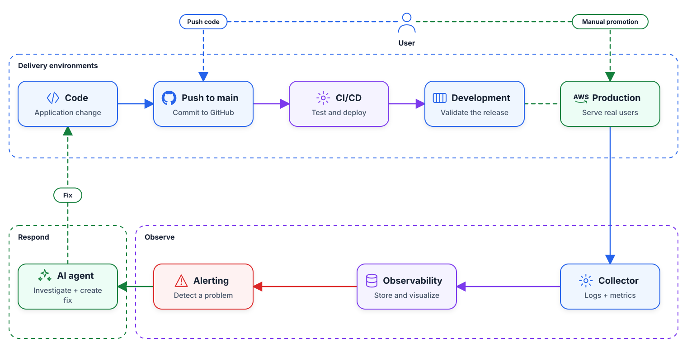
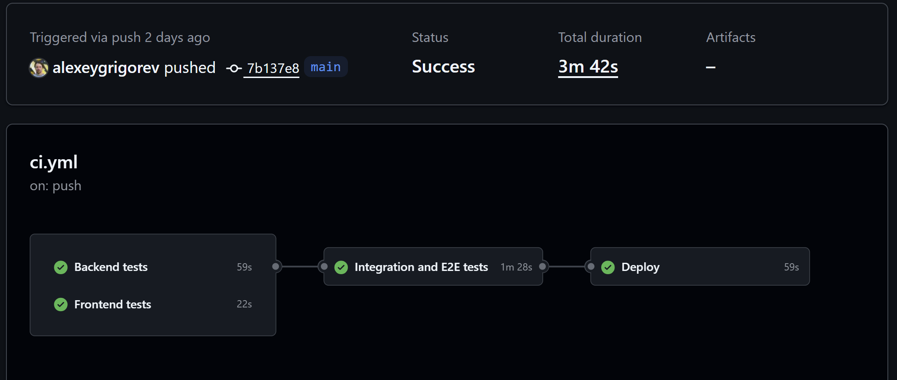
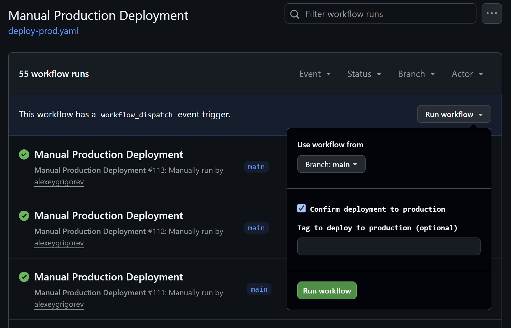

# DevOps and Observability for an AI-Built App

This is the fourth article in a series based on
[AI Dev Tools Zoomcamp](https://github.com/DataTalksClub/ai-dev-tools-zoomcamp),
the free course we run at DataTalks.Club.

All articles in the series:

- Part 1: [AI-Native Development: Specifications, Loop and Graph Engineering](https://aishippingblog.com/p/ai-native-development-specifications)
- Part 2: [Build and Ship a Full-Stack App with AI Coding Assistants](https://aishippingblog.com/p/build-and-ship-a-full-stack-app-with)
- Part 3: [Deploy a Full-Stack App with AI Coding Assistants](https://aishippingblog.com/p/deploy-a-full-stack-app-with-ai-coding)
- Part 4: [DevOps and Observability for an AI-Built App](https://aishippingblog.com/p/devops-and-observability-for-an-ai) (this article)
- Part 5: TBA

In part 2, we developed an application for conducting system design
interviews. In part 3, we deployed it to a cloud environment and configured
CI/CD.

In this part, we make the deployed application easier to operate:

- Separate development and production environments.
- Promote the exact version tested in development.
- Collect metrics, traces, and logs.
- Alert on a user-visible failure.
- Use an AI agent as the first responder.


<figure>
  
  <figcaption>Deploy changes to development first, promote a tested release to production, and respond to observed failures</figcaption>
</figure>

We will continue using AWS and CloudFormation, but the principles we show in this article are tool-agnosting and will work for any environment.


## Recap


We started building the [Interview Canvas project](https://github.com/alexeygrigorev/interview-canvas-share) in [Part 2: Build and Ship a Full-Stack App with AI Coding Assistants](https://aishippingblog.com/p/build-and-ship-a-full-stack-app-with):

- We brainstormed with an AI assistant to come up with the specification
- Based on that we created a React-based frontend with no backend
- Next, we defined the frontend-backend OpenAPI schema
- Using the API contract we created the backend
- We added database support with SQLite and SQLAlchemy

The app was running locally, and then we deployed it in [Part 3: Deploy a Full-Stack App with AI Coding Assistants](https://aishippingblog.com/p/deploy-a-full-stack-app-with-ai-coding):

- We containerized the application
- Then added Postgres support
- To make sure the system works reliably, we created integration and end-to-end tests
- We deployed it to AWS
- In the end, we set up CI/CD via GitHub Actions, so every push runs the tests
  and deploys the app to development

<figure>
  
  <figcaption>Each tested push is deployed to development. Production promotion is a separate step</figcaption>
</figure>

Now we take the application that's already deployed and make it follow production best practices.


## Dev and prod environments

When we push the code, we automatically deploy this code and the changes to live immediately. It's okay when we only start working on our project. But when we have real users, we want to be more careful, and check if our changes didn't introduce any problems. 

To avoid having this problem, we usally have two copies of the same environment:

- Dev (development): the environment we use internally for checking that everything works. Typically we run the latest version of our project there, and every time we push, the changes are automatically deployed there.
- Prod (production): this is what our users use. We don't want to deploy every single change there automatically and we want to have more control over the process.


Because we previously defined our infrastructure as code, duplicating it is trivial. We most likely will need to change a few things, like the size of the machine where the application is running (production typically needs a more powerful machine), but the majority of the resources will stay the same. 

Let's ask our coding assitant to create a copy of the exiting environment and call it "production":

```text
Create a second, independent copy of our infrastructure. We will use the copy as production, and existing infrastructure as a dev environment. 
```

Once we have the prod environment, let's update our CI/CD. We will only deploy to dev on every push. For production, we will have a manual action, that will take whatever development has and _promote_ (apply) it to production.

```text
Create a manual GitHub Actions workflow that promotes the dev version to production.
```

<figure>
  
  <figcaption>A person approves the production deployment and can select the release to promote</figcaption>
</figure>

Now we have two environments

TODO: Image: users use prod, testers use dev 


## Docker image repository

In the pipeline we have so far, the image is built during the deploy stage.

TODO: illustration

This is an anti-pattern. In my setup, I deploy to EC2 by executing the build script on the machine and then running the image in Docker. 

There are multiple problems with this approach:

1. The deploy stage is actually two things: build and deploy. If build fails, there should be no deploy, so it's better to have these steps separately. 
2. When we promote the dev version to production, we have to build again. During this time, many things could have changed, so the build will not be identical to dev, and it can cause problems.

So we split the deploy step into two separate steps and then:

- Build the image and upload it to a container registry
- Pull this image from the registry during the deploy 
- When promoting to prod, we simply pull the same image to prod

For AWS, we can use [Amazon ECR](https://aws.amazon.com/ecr/) as the container registry. You can also push your images to Docker if you're running outside of AWS and your cloud doesn't have a special service for that.

TOOD: illustration

Let's implement that:

```text
Currently we build the image during the deploy stage.

Split it into two stages:

- Build: build the image and push it to a container registry (ECR)
- Deploy: pull the image from the registry and serve it

The manual prod promotion workflow pulls the currently deployed dev image to prod.

Tag each image using YYYY-MM-DD-gitsha1 pattern (e.g. "2026-08-18-a1b2c3d")
```

(TODO use this for illustration)
With this setup, we follow this path to release:

- push to main
- run tests
- build the image and tag it 
- push the image to the registry
- deploy the image to development
- manually promote that image to production


## Observability

Having two enviromnet is helpful for avoiding accidental pushes with buggy code to production. But accidents will still happen and we need to make sure we detect them and can react timely. 

For that we usually add monitoring to our applications. At the mininum, we collect the basic performance metrics like CPU and memory utilization and requests per second (RPS). 

If we see that CPU and memory utilization are growing and RPS is dropping, something is definitely off and we need to investigae.

TODO let's also define observability

## OpenTelemetry

To collect this information, we'll use [OpenTelemetry](https://opentelemetry.io/docs/) (often abbreviated as OTel).

the OTel specification definines... TODO
OTLP - what's that 


For many popular libraries, we can start collecting metrics with just a few lines of code. This process is called "intrumenting" - injecting extra logic into exiting libraries (like FastAPI) so we can collect logs and metrics from there. 

Let's do it:

```text
Instrument the backend with OpenTelemetry.

Include:

- service name
- environment
- deployed git commit 

in the telemetry
```

OTel (OTLP) only describes what data we collect, but we don't specify how or where.  Let's do it now.

TODO pic

## OTel Collectors

We capture telemetry with OTLP, but it doesn't go anywhere. Next, we need to define were exactly we send it. For that, we define 
an [OpenTelemetry Collector](https://opentelemetry.io/docs/collector/)
between the application and the storage systems.

There are many places where you can send this data to. You can talk to your AI assistant and figure out what's the best service for you for that. 

In our case, I'll use:

- Prometheus for metrics
- Loki for logs
- Tempo for traces
- Grafana for displaying the dashboards

Previously I never used Loki or Tempo, but when I was telling my coding agent what I wanted to do, it suggested me these technologies. I looked them up, read about them, and concluded that they work well for this application.

So let's impmenent it:

```text
Add an OpenTelemetry Collector.

Create an observability/ directory with Docker Compose for:

- OpenTelemetry Collector
- Prometheus
- Loki
- Tempo
- Grafana

Keep this as a separate Compose project from the application stack.
```

TODO pic

We don't have any dashboards yet, so let's build one. 

## Metrics

With OTel we can collect ... but it's not enough (TODO continue)

That's a good start, but it won't let us know what exactly is failing. We need to have more information about the health of our application. 

We also need to collect important metrics

For System Design Canva, useful measurements may include:

- Total number of interview rooms
- Number of active rooms and number of active participants
- Number of elements on the canvas across the application
- Change propagation delay - when I add an element to the canva, how long does it take for you to see it
- Number of errors 


Let's start collecting them too:

```text
Track these application metrics:

- interview rooms created
- active interview participants
- canvas elements created

Display these metrics in Grafana and include the environment and deployed
version.
```


After that we can ask the assistant to run Grafana for us and see the results.

If the assistnat didn't create the dashboards eyet, we can ask for it explicitly

```text
Add Grafana panels for

- interview rooms created
- active interview participants
- canvas elements created
- failures in component creation

Make it possible to filter by environment and deployed version
```


TODO picture of grafana

Next you can run it locally by running something like that: 

```bash
docker compose -f observability/docker-compose.yaml up -d
```

We can test it by openinig our application, creating a room, adding a canvas element, and checking that it appears in Grafana.


## Deploy the observability stack

We verified that it works locally, so let's now deploy it. If you use the same stack as me (Prometheus, Grafana and others), we need to deploy and manage them ourselves.

If you use a managed OTel-compatible vendor (TODO add examples), you can skip this step. You can also use a hosted
service such as CloudWatch, Grafana Cloud, Datadog, or Sentry.


Let's deploy it:

```text
Deploy the observability stack separately from the application stack.
Connect both development and production to it.
Keep the environment and deployed version on every metric, trace, and log.
```

After it finishes, you can open Grafana and perform the same test as locally. 

In practice, you don't deploy Grafana and Prometheus openly on the Internet. Like databases, you typically hide them behind a VPC to make sure (... continie - TODO).

## Alerting

We have the dashboards but we can't watch them all the time to see if some metrics drop or grow too large. If this happens, we have a systme that tiggers an alert saying that something happene.d  


```text
TODO: let's redo it to make it based on what we did before

Add an actionable alert for repeated canvas component-creation failures.

Use a threshold and duration that represent real user impact. Include the
service, environment, deployed version, owner, and dashboard URL in the alert.
```

## On-Call Engineer 

Now that we have alerts, we need to react to them. In companies there's usually an on-call engineer. Thta's the enginer that receives the alert when something happens. When it happens, they need to figure out what's heppening, and find a quick solution to this problem to stop the problem. 

our Ai assistant can be the On-Call engineer and if something happens, it can try to fix it. In real scenarios, AI oncall agents also need to undestand if the issue is serious enoguh to escalate the alert to a human on-call engineer.

In our case, we won't do it. We will immplemt a systm that checks prometheus and grafana for aleter,s and if something is happening, an agent session will start and fix the problem.


```text
Add an on-call-engineer/ directory with a script that polls the observability
alert API every minute.

When an alert fires, pass the alert details to a headless coding agent.
```

As a result we have

- TODO
- ...
- ... 

In my case, the agent had this prompt: 

Note that for this agent you may want to limit the access to the bare minimum: logs and X (todo). When it finds the fix, it pushes it to main, so it gets deployed, and optionally it can also trigger a manual deploy to prod (if you trust you process).

```text
You are the on-call engineer for this repository. An alert just fired.

Investigate the root cause. Read the code and reproduce the failure.
If you find a real bug, make the smallest correction, run the backend tests,
and commit the fix with a clear message.
If the alert is a false positive, explain why and do not change the code.
```


TOOD picture


This is a small proof-of-concept script. In reality you will probably have a sysmte htat looks like that:;

- Alert is triggered and send via SNS or similar 
- A lambad reacts to that alert and starts a container job 
- the job launches codex or claude in headless mode 
- once the session is over, the logs are saved and the machine is terminated

TOOD picture

Let's test it by intriducing a bug

## Introducing a bug

We want to test that this system works. So let's start a coding agent to introduce a bug - or find an existing one. 

```text
Introduce a realistic bug in canvas component creation.

For some requests, creating a component should fail even though the existing
tests pass. Keep the failure reproducible so we can test the alert and the
on-call response.
```

Here the goal is to debug the process and make sure our on-call engineer actually wakes up and solves the problem. 

After a few back-and-forth (what? todo) it will work.

TODO screenshot 


## Summary


## Clean up

After you finish everything for the module, I recommend cleaning up everything. We created these things for learning, so we shouldn't forget to clean them up. Because if you don't, expect a bigger bill at the end of the month. 

As your agent to clean the infra:

```
delete the cloudformation stacks
```

After it finishes, make sure everythig is indeed gone. You may want to double check everything in the AWS console or ask another agent to scan the running resources in your account.  


## Next steps after this module

We now have a narrow operating baseline. We can promote a change deliberately,
observe one important user journey, and prepare a response to a known failure.
We can extend it in stages rather than add every practice in one go.


Start with reliability by defining an SLI and SLO for an important journey such
as canvas sync. Add an error-budget burn-rate alert and an external synthetic
check so we notice when the app or the monitoring path fails.

Then make deployments safer with canaries or progressive rollouts, feature
flags for risky changes, and the previous release ready for rollback. Restore
a database backup because an untested backup is only a promise.

Then broaden the security evidence by scanning dependencies, secrets,
containers, and infrastructure code. Generate an SBOM and build provenance.
Add manual penetration testing and a clear path for vulnerability reports.

Raise agent autonomy last by recording what the on-call agent can read and
write and what enforces each limit. Test model upgrades against past incidents.
Widen the blast radius only when incident records show that the narrower
version is repetitive, bounded, and independently verifiable.

If we add one thing, start with an SLI and SLO for the app's most important
journey. That tells us which failures matter before we add more dashboards,
alerts, or agents.


## Next in the series

With these pieces, we can promote a change deliberately, see a failure, and
investigate it within a bounded workflow.

In the next module, we cover these coding-agent capabilities:

- MCP
- skills
- commands
- plugins
- specialized agents

We apply the same boundaries there too. Every new capability should have a
clear owner, permissions, data path, and review process.

You can find the course materials and the next cohort in
[AI Dev Tools Zoomcamp](https://github.com/DataTalksClub/ai-dev-tools-zoomcamp).
It's free.
