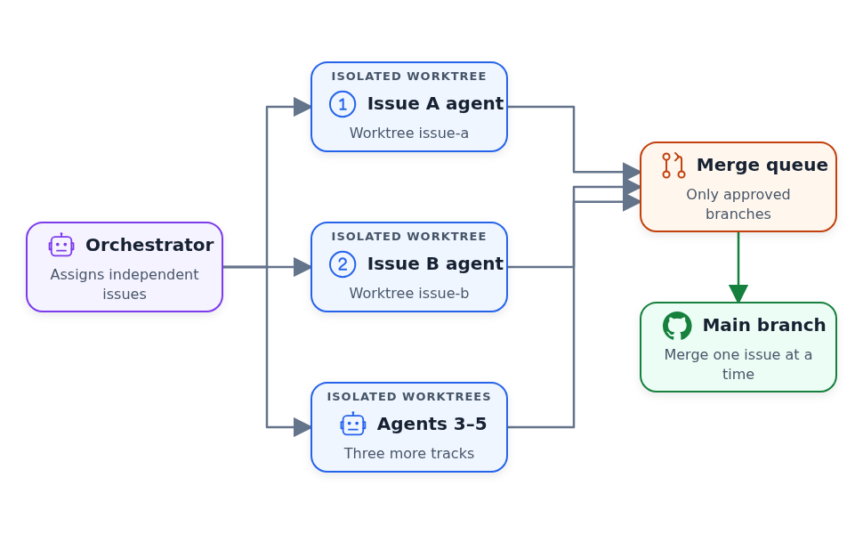

# Coding Agent Building Blocks: Reusable Skills and Specialized Subagents

This is the fifth article in a series based on
[AI Dev Tools Zoomcamp](https://github.com/DataTalksClub/ai-dev-tools-zoomcamp),
the free course we run at DataTalks.Club.

All articles in the series:

- Part 1: [AI-Native Development: Specifications, Loop and Graph Engineering](https://aishippingblog.com/p/ai-native-development-specifications)
- Part 2: [Build and Ship a Full-Stack App with AI Coding Assistants](https://aishippingblog.com/p/build-and-ship-a-full-stack-app-with)
- Part 3: [Deploy a Full-Stack App with AI Coding Assistants](https://aishippingblog.com/p/deploy-a-full-stack-app-with-ai-coding)
- Part 4: [DevOps and Observability for an AI-Built App](https://aishippingblog.com/p/devops-and-observability-for-an-ai)
- Part 5: Coding Agent Building Blocks: Reusable Skills and Specialized Subagents (this article)

In this article, I want to cover the two most important aspects of
working with coding assistants: skills and subagents.
Getting these two right is enough to work with agents productively, and you most likely won't need anything else.

I already have an article about [Setting up a coding agent](https://aishippingblog.com/p/how-to-set-up-your-coding-agent-a), where I talk about skills and subagents. This article is complimentary and I [preach] the same idea there: using skills and subagents is enough to get started ... 


## From Article 1 to Explicit Building Blocks (differnt name)

In Part 1 of the course, [AI-Native Development: Specifications, Loop and Graph Engineering](https://aishippingblog.com/p/ai-native-development-specifications), we touched both concepts but didn't define them exlicitly. 

Specifically, we created a few documents:

- `_docs/process.md`, and the other project documents contained
  reusable instructions (see [here](https://github.com/alexeygrigorev/retroloop/tree/main/_docs))
- `_docs/team/pm.md`, `_docs/team/software-engineer.md`, and
  `_docs/team/qa-engineer.md` described specialized roles that we ran in fresh
  sessions or launched as subagents (see [here](https://github.com/alexeygrigorev/retroloop/tree/main/_docs/team)).

In that article, I wanted to keep the discussion high-level and not focus on ...

And we actually didn't need to explicitly define them. Coding agents can read any markdown document when you ask them and follow the intsructions from there. 

So that's enoh so I can tell a coding assitant 

```
You're a QA engineer. Your role is defined in `_docs/team/qa-engineer.md`. Review work for task #101.
```

And that's enough to work.

Now I want to address that and explain what is what, ...

in this article I want to go from juggling with md files to using these build-in primitives. 

## Building Block 1: Skills

A skill is a structured set of instructions for a repeatable procedure.

I use skills for rpocesses that require following a spefic sequence of action. 


I maintain a lot of Python libraries that I need to regularly update and publish.

I describe the process here: https://aishippingblog.com/p/my-pypi-release-pipeline-for-python

It's a rpocess with multiple steps:

- step 1
...
- step n

When I want to publish a new library or update the version of a library I'm maintaining, I don't want to describe the process over and over again. 

With skills, I can describe these processes in [markdown file](https://github.com/alexeygrigorev/.agents/blob/main/skills/release/SKILL.md) and just say:

```
release a new versoin
```

The agent undestsand my intent, sees the available skill, loads it and follows the process in this skill. 

Inside, a skill is a markdown file that looks like that:

```
TODO
```

https://agentskills.io/specification - more about specs 

The best way to understand how skills work is to build a small coding agent with skills. 
In the AI Shipping Labs workshop
[Build a Coding Agent with Tools, Skills and PydanticAI](https://aishippinglabs.com/workshops/coding-agent-v2),
we build a coding agent with skill support. We start with tool calls and an
agent loop, add reusable skills, and then port the agent to PydanticAI.


### Global Skills

There are some skills that all your projects need. But some are only needed for local work. 

Example of global skills:

- With [`release`](https://github.com/alexeygrigorev/.agents/tree/main/skills/release),
  I bump the version, push a tag, and let CI publish the package. With [`init-library`](https://github.com/alexeygrigorev/.agents/tree/main/skills/init-library),
  I create a Python library with packaging, tests, linting, and optional CLI
  support. With [`create-github-repo`](https://github.com/alexeygrigorev/.agents/tree/main/skills/create-github-repo),
  I create a GitHub repository and push the current project. (todo compress)
- With [`fetch-youtube`](https://github.com/alexeygrigorev/.agents/tree/main/skills/fetch-youtube),
  [`fetch-loom`](https://github.com/alexeygrigorev/.agents/tree/main/skills/fetch-loom),
  and [`fetch-zoom`](https://github.com/alexeygrigorev/.agents/tree/main/skills/fetch-zoom),
  I fetch recordings or transcripts for the agent to analyze.
- With [`diagram-creator`](https://github.com/alexeygrigorev/.agents/tree/main/skills/diagram-creator),
  I turn a JSON specification into consistent SVG and PNG diagrams.

I need these skills in many projects so I make them global, and I can load them from any project. 

To make a skill globally available, put it in ~/.codex/skills or ~/.agents skills. In my case, I keep my global skills in one signle place ([.agents](https://github.com/alexeygrigorev/.agents)) and add symlinks to the skills folder to ~/.codex/skills, ~/.agents skills and all other agents I use. 


### Project-Specific Skills

There are a a few skills that are useful for many projects, but most skills are project-specific. So we don't need to put them globally. 

For example, in my projects 

- [Course Management Platform](https://github.com/DataTalksClub/course-management-platform/tree/main/.agents/skills)
  has an [incident-response](https://github.com/DataTalksClub/course-management-platform/tree/main/.agents/skills/cmp-incident-response) skill. every time there's an alert, it knows how to investigate and fix the problem (simiarl to what we covered in article 4 (todo link))
- [DataTalks.Club FAQ](https://github.com/DataTalksClub/faq/tree/main/.agents/skills)
  has skills for fetching course questions from Slack and turning recurring
  questions into FAQ entries.

They work in the same way, but discoverable only for coding assisntats running for this specific project. 

You place these skills in `.agents/skills` or in `.agents/skills`.

It's annoying that Claude Code doesn't follow the standard convention, so I put my skills in `.agents/skills` and create a symlink `.agents/skills` to `.agents/skills`.


### Creating skills

TODO from the workshop video


## Building Block 2: Subagents

A coding agent has a finite context window. In one session, it
plans, implements, and reviews a task. As that context fills, the agent can lose some important details. This is called "context rot".

That's why I often start each new task in a new session. And this is what I recommended to do in https://aishippingblog.com/p/from-idea-to-production - for each of the 28 prompts I recommend to start a new session.

Also, the actions that the agents has done so far inflience its future actions. If we have an agent that imlmeneted a feature, we don't want to ask it to test it. TODO explain why using terms and wors from article 1. 

In article 1 I dscribed the process:

- PM grooms an issue
- SWE implements it
- QA tests it, and outputs PASS if everything is fine, FAIL if the task is not done
- If it's FAIL, SWE needs to fix it

If I have an issue #101 that's arelady groomed, and want to implement it I can start a new session and say:

```
You're a software engineer agent. Your role is described in `_docs/team/swe.md`. Work on issue #101
```

But instead, I can have one main coding session that I'll treat as the orchestrator, and ask it to launch the agent: 

```
Launch a subagent to implement #101. Follow the process
```

It will create a new agent with an empty context, and it will automatically prompt it. Some coding assistnants also let you peek inside the sessions of subagents, and for some you only know that they are doing something but you don't know what exactly.

I usually describe this in my process.md document that you always run subagents to do it, so your ask to the orchestrator could be 

```
Implement #101
``` 

And it will automatically run #101 though the PM->SWE->QA sequence, and each step will run in its own fresh context.


## TOOD

In the first article, we run this sequentially. For one task, we can't do it in any other way: we have to keep the sequence from PM to SWE and from SWE to QA.

But we can take care of multile independent issues in parallel. 

FOr taht we need two concepts:

- Git Worktrees
- The main session is hte orchestrator 

We need worktrees so agnens  can edit, test, and commit without
overwriting each other chagnes

The main session orhcestrates eveyrthing: it keep track of the status for each task, schedules the agents, creates and merges workrees. It also prevents logical conflicts: it can notice that two issues need updating the same files, so it's better not to run them in parallel, because merging the changes will be difficult. 


<figure>
  
  <figcaption>Agents work concurrently in isolated worktrees while the orchestrator controls review and merge order</figcaption>
</figure>

To set it up, i put something like this in the process.md file

```text
Work in isolated git worktrees and run up to five agents in parallel.

You are the orchestrator. Your job is to:

- Split the backlog into independent issue tracks.
- Give each agent a separate worktree and clear file ownership.
- Keep the agent slots full while eligible work remains.
- Send completed work to a fresh reviewer.
- Return review findings to the correct implementer.
- Merge approved work into the main branch one issue at a time.
- Coordinate the work; do not implement the issues yourself.
```

I use this approach for most of my projects.


## Creating and Iterating on Skills

I don't start by designing a skill. I first do the real task with the agent as
usual. When it takes a wrong turn, I correct it and continue until both the
result and the way we produced it are right.

At the end of the session, I say:

```text
Save this as a skill. Include the workflow we followed and all the corrections
I made, so the next agent can do the task correctly from the start.
```

From the session, I can see what worked and every correction I made. I can
ask the agent to turn that history into a practical skill instead of
inventing a workflow in advance.

I then review the generated `SKILL.md` and remove details that only mattered in
that session. I also make sure its description says when an agent should load
it. If the project already has skills, the agent can follow their structure.

## Improving an Existing Skill

I improve the first version through the same cycle:

1. Trigger the skill and let it run
2. When it does something wrong, correct it in the session
3. After fixing the issue, ask the agent to analyze its actions and your
   corrections
4. The agent analyzes everything and updates the skill file

I improve skills through real usage: each correction makes the next run
better.

## Analysis and Implementation Models

I use skills and subagents to structure the work, and I choose models with the
same split in mind.

I pick models by role:

- For analysis, I use Fable or Sol. They read a spec, look at the current
  code, and produce a concrete plan before implementation starts.
- For implementation, I use Sonnet or Luna Max. Once the plan is clear, they
  write the code, run the checks, and fix what breaks.

These model names may change, but I keep the same split: analysis first,
implementation second. I can repeat both passes with skills. I run analysis
and verification passes in subagents so they don't inherit the implementer's
assumptions.


## Practical Takeaways

Keep these rules in mind when you structure your agent setup:

- Start with skills: identify repeated flows and encode them as Markdown
  playbooks
- Add subagents when context is a problem: if tasks are too large for a single
  agent session, break them into roles
- Keep skills simple: one flow per skill. If it branches, split it
- Give each subagent a fresh context window so details from another role don't
  interfere
- Build incrementally: start with one skill and one subagent. Add more as you
  discover what your flow needs
- Always verify: even the best models take shortcuts. I encode the "right way"
  in skills, and reviewer subagents catch what the implementer missed

## Resources

I use these resources for the course, workshop, and shared skills:

- [AI Dev Tools Zoomcamp](https://github.com/DataTalksClub/ai-dev-tools-zoomcamp) (free course)
- [Workshop 5: Coding Agent Capabilities](https://www.youtube.com/watch?v=t8OrAjNO2Zs)
- [Build a Coding Agent with Tools, Skills and PydanticAI](https://aishippinglabs.com/workshops/coding-agent-v2)
- [My agent configuration](https://github.com/alexeygrigorev/.agents) (shared skills for Claude Code, Codex, and OpenCode)

## Related Substack Articles

Read these for more detail on the examples:

- [How to Set Up Your Coding Agent](https://aishippingblog.com/p/how-to-set-up-your-coding-agent-a)
- [My Experiments with Claude Code](https://aishippingblog.com/p/my-experiments-with-agents-code)
- [AI-Native Development: Specifications, Loop and Graph Engineering](https://aishippingblog.com/p/ai-native-development-specifications)
