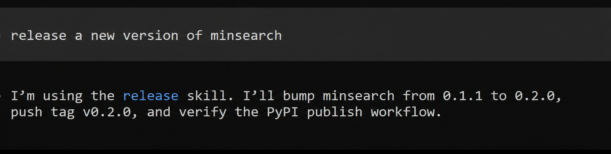

# Coding Agent Building Blocks: Reusable Skills and Specialized Subagents

This is the fifth article in a series based on
[AI Dev Tools Zoomcamp](https://github.com/DataTalksClub/ai-dev-tools-zoomcamp),
the free course we run at DataTalks.Club.

All articles in the series:

- Part 1: [AI-Native Development: Specifications, Loop and Graph Engineering](https://aishippingblog.com/p/ai-native-development-specifications)
- Part 2: [Build and Ship a Full-Stack App with AI Coding Assistants](https://aishippingblog.com/p/build-and-ship-a-full-stack-app-with)
- Part 3: [Deploy a Full-Stack App with AI Coding Assistants](https://aishippingblog.com/p/deploy-a-full-stack-app-with-ai-coding)
- Part 4: [DevOps and Observability for an AI-Built App](https://aishippingblog.com/p/devops-and-observability-for-an-ai)
- Part 5: Coding Agent Building Blocks: Reusable Skills and Specialized Subagents (this article)

In this article, I want to cover the two most important aspects of
working with coding assistants: skills and subagents.

- A skill describes how to perform a repeatable task.
- A subagent is an agent that runs in separate context with clear task instructions.

In addition, I'll cover my process for creating skills and show how to run multiple agents in parallel and turn your coding agent into a task orchestrator.

Getting these concepts is enough to work with coding agents productively, and you most likely won't need anything else.

This article is loosely based on a live workshop I did for the course. In the workshop, I had to improvise a lot, so the content doesn't directly map to this article. But it's still going to be useful, so check it out.

https://www.youtube.com/watch?v=t8OrAjNO2Zs


## XXX

In Part 1 of the course, [AI-Native Development: Specifications, Loop and Graph Engineering](https://aishippingblog.com/p/ai-native-development-specifications), we touched on both skills and subagents but, I didn't define them explicitly.

Specifically, we created a few documents:

- `_docs/process.md` and the other project documents contained
  reusable instructions (see [here](https://github.com/alexeygrigorev/retroloop/tree/main/_docs))
- `_docs/team/pm.md`, `_docs/team/software-engineer.md`, and
  `_docs/team/qa-engineer.md` described specialized roles for subagents (see [here](https://github.com/alexeygrigorev/retroloop/tree/main/_docs/team)).

I wanted to keep the discussion high-level and not focus on the mechanics of any specific implementation. But these concepts are quite important, so I wanted to come back to them and devote them a separate article.

We didn't explicitly define them because we can tell a coding assistant:

```
Implement feature #101 following _docs/process.md
```

It will read the document and follow the steps there.

Or you can also speficy the role of the agent at the beginning of a session:

```text
You're a QA engineer. Your role is defined in `_docs/team/qa-engineer.md`. Review work for task #101.
```

Even better, you can ask it to start a subagent with this role:

```text
Start a QA engineer subagent. The role is defined in `_docs/team/qa-engineer.md`. Review work for task #101.
```

That's enough to work. The coding assistant can just go read the file and do the task.

But if you define these things as skills and subagents explicitly, you'll be more effective in using them. In this article, I'll show you how.

Let's start with skills.

## Building Block 1: Skills

A skill is a structured set of instructions for a repeatable procedure.

If you need to follow a specific sequence of actions for completing a task, you can document the steps in a skill. Then later you can ask the agent to use this skill to perform a task. It will read the file and follow the steps from there.

For example, I maintain a lot of Python libraries that I need to regularly update and publish. I describe how I do it in [My PyPI Release Pipeline for Python Libraries](https://aishippingblog.com/p/my-pypi-release-pipeline-for-python).

It's a process with multiple steps:

- Run the tests
- Update the version in pyproject.toml
- Push the code to GitHib as a tag
- Verify that CI publishes the package

If I want to release a new version of minsearch, I don't want to describe this step to the agent each time I do it. Instead, I document this in a [markdown file](https://github.com/alexeygrigorev/.agents/blob/main/skills/release/SKILL.md) and just say:

```text
release a new version
```

The agent understands what I need, sees an available skill that's suitable for this task, loads it, and follows the steps there.

<figure>
  
  <figcaption>The agent recognizes the release request and loads the relevant skill without an explicit skill command</figcaption>
</figure>

Internally, a skill is a markdown file that looks like that:

```markdown
---
name: release
description: Release the current project by bumping the version, pushing a tag, and letting CI publish it.
---

# Release

1. Inspect the project and determine its package registry.
2. Run the tests and other required checks.
3. Bump the version in the source of truth.
4. Commit the change and push a version tag.
5. Verify that the CI publishing job succeeds.
```

I use the name to invoke the skill directly. The agent uses the description to
discover the skill from a regular request. I put the procedure in the rest of
the file and can add helper scripts or reference files. The agent can then reuse
a command that already works instead of deriving it again.

https://agentskills.io/specification - more about specs 

The best way to understand how skills work is to build a small coding agent with skills. In the AI Shipping Labs workshop
[Build a Coding Agent with Tools, Skills and PydanticAI](https://aishippinglabs.com/workshops/coding-agent-v2),
we build a coding agent with skill support. We first learn about agents and function calls, and then see how to implement a special function for loading skills.


### Global Skills

There are some skills that all your projects need. But some are only needed for local work. 

Example of global skills:

- With [`release`](https://github.com/alexeygrigorev/.agents/tree/main/skills/release),
  I bump the version, push a tag, and let CI publish the package. With [`init-library`](https://github.com/alexeygrigorev/.agents/tree/main/skills/init-library),
  I create a Python library with packaging, tests, linting, and optional CLI
  support. With [`create-github-repo`](https://github.com/alexeygrigorev/.agents/tree/main/skills/create-github-repo),
  I create a GitHub repository and push the current project.
- With [`fetch-youtube`](https://github.com/alexeygrigorev/.agents/tree/main/skills/fetch-youtube),
  [`fetch-loom`](https://github.com/alexeygrigorev/.agents/tree/main/skills/fetch-loom),
  and [`fetch-zoom`](https://github.com/alexeygrigorev/.agents/tree/main/skills/fetch-zoom),
  I fetch recordings or transcripts for the agent to analyze.
- With [`diagram-creator`](https://github.com/alexeygrigorev/.agents/tree/main/skills/diagram-creator),
  I turn a JSON specification into consistent SVG and PNG diagrams.

I need these skills in many projects, so I make them global and load them from
any project. Different coding agents look for global skills in different
directories. I keep one canonical copy in my
[`agents` repository](https://github.com/alexeygrigorev/.agents) and link that
collection into directories such as `~/.codex/skills` and `~/.claude/skills`.
This gives Codex, Claude Code, and my other agents the same instructions on
every computer I use.


### Project-Specific Skills

There are a few skills that are useful for many projects, but most skills are project-specific. So we don't need to put them globally.

For example, in my projects:

- [Course Management Platform](https://github.com/DataTalksClub/course-management-platform/tree/main/.agents/skills)
  has an [incident-response](https://github.com/DataTalksClub/course-management-platform/tree/main/.agents/skills/cmp-incident-response) skill. Every time there's an alert, it knows how to investigate and fix the problem, similar to what we covered in [Article 4](https://aishippingblog.com/p/devops-and-observability-for-an-ai).
- [DataTalks.Club FAQ](https://github.com/DataTalksClub/faq/tree/main/.agents/skills)
  has skills for fetching course questions from Slack and turning recurring
  questions into FAQ entries.

They work in the same way, but coding assistants discover them only while
working in that project.

Not every coding agent searches the same project directory. I keep one copy of
each skill in the repository. I then add a symlink for an agent-specific
directory or use `AGENTS.md` and `CLAUDE.md` to tell the agent where to find the
skills and subagent definitions. Because the underlying files are Markdown,
the same definitions can work across agent harnesses.


### Creating skills

I don't usually start by designing a skill in the abstract. I do the task with
the agent first. It tries an approach, I correct it, and we continue until we
get the right result in the right way.

Then I say:

```text
Save this as a skill. Include the workflow we followed and the corrections I
made, so the next agent can do the task correctly from the start.
```

This is how I created my recording skills. The first time I needed to download
a recording and get its transcript, the agent explored several approaches.
Once one worked, I asked it to save that procedure and the working script. The
next time, it could fetch the recording immediately.

I improve an existing skill in the same way:

1. Trigger the skill on a real task.
2. Correct the agent when the procedure is incomplete or wrong.
3. Finish and verify the task.
4. Ask the agent to update the skill from the successful session.

This gives me instructions grounded in real work, including mistakes we already
found and fixed. I still review the generated `SKILL.md` and remove details that
only mattered in that session. I also make sure the description clearly says
when the agent should load the skill.


## Building Block 2: Subagents

A coding agent has a finite context window. In one session, it
plans, implements, and reviews a task. As that context fills, the agent can lose some important details. This is called "context rot".

That's why I often start each new task in a new session. This is also what I recommended in [From Idea to Production](https://aishippingblog.com/p/from-idea-to-production): start a new session for each of the 28 prompts.

Also, the actions that the agent has taken so far influence its future actions. If an agent implemented a feature, we don't want to ask the same agent to test it. Its implementation history can lead it to accept its own assumptions instead of checking the result independently against the specification.

In Article 1, I described the process:

- PM grooms an issue.
- SWE implements it.
- QA tests it and outputs `PASS` if everything is fine or `FAIL` if the task isn't done.
- If the result is `FAIL`, SWE needs to fix it.

If I have an issue #101 that's already groomed and I want to implement it, I can start a new session and say:

```text
You're a software engineer agent. Your role is described in `_docs/team/swe.md`. Work on issue #101.
```

But instead, I can have one main coding session that I'll treat as the orchestrator and ask it to launch the agent:

```text
Launch a subagent to implement #101. Follow the process.
```

It will create a new agent with an empty context and automatically prompt it. Some coding assistants also let you peek inside subagent sessions. With others, you only know that they are doing something, but you don't know exactly what.

Instead of launching only general-purpose agents, I can define reusable roles.
A simplified implementer definition looks like this:

```markdown
---
name: implementer
description: Use this agent to execute a well-scoped coding assignment.
model: implementation-model
---

Implement the assigned task, add or update tests, run the project checks, and
report the files changed and any remaining risks. Do not expand the scope.
```

Agent definitions can also select a model and restrict tools. I often use a
stronger reasoning model to audit a codebase or produce a plan, save that plan
in the repository, and hand it to a faster implementation agent. The model names
will change; the useful pattern is to separate analysis from execution.

I usually specify in my `process.md` document that the orchestrator should always run subagents, so my request could be:

```text
Implement #101.
``` 

It will automatically run #101 through the PM -> SWE -> QA sequence, and each step will run in its own fresh context.

Skills and subagents can be composed. For example, a `check-design` skill can
define the repeatable mechanics:

1. Start the application.
2. Open it in a browser at desktop and mobile sizes.
3. Capture screenshots.
4. Launch the designer subagent with the screenshots and the project's design
   system.
5. Save actionable findings for an implementer.

The skill preserves the sequence, the designer definition preserves the role,
and the fresh subagent context keeps the review independent.


## Parallel Subagents with Git Worktrees

In the first article, we run this sequentially. For one task, we can't do it in any other way: we have to keep the sequence from PM to SWE and from SWE to QA.

But we can take care of multiple independent issues in parallel.

For that, we need two concepts:

- Git worktrees
- The main session is the orchestrator

We need worktrees so agents can edit, test, and commit without
overwriting each other's changes.

The main session orchestrates everything: it keeps track of the status of each task, schedules the agents, and creates and merges worktrees. It also prevents logical conflicts. It can notice when two issues need to update the same files, so it's better not to run them in parallel because merging the changes will be difficult.


<figure>
  
  <figcaption>Agents work concurrently in isolated worktrees while the orchestrator controls review and merge order</figcaption>
</figure>

To set it up, I put something like this in the `process.md` file:

```text
Work in isolated git worktrees and run up to five agents in parallel.

You are the orchestrator. Your job is to:

- Split the backlog into independent issue tracks.
- Give each agent a separate worktree and clear file ownership.
- Keep the agent slots full while eligible work remains.
- Send completed work to a fresh reviewer.
- Return review findings to the correct implementer.
- Merge approved work into the main branch one issue at a time.
- Coordinate the work; do not implement the issues yourself.
```

I use this approach for most of my projects.


## Analysis and Implementation Models

I use skills and subagents to structure the work, and I choose models with the
same split in mind.

I pick models by role:

- For analysis, I use Fable or Sol. They read a spec, look at the current
  code, and produce a concrete plan before implementation starts.
- For implementation, I use Sonnet or Luna Max. Once the plan is clear, they
  write the code, run the checks, and fix what breaks.

These model names may change, but I keep the same split: analysis first,
implementation second. I can repeat both passes with skills. I run analysis
and verification passes in subagents so they don't inherit the implementer's
assumptions.


## Practical Takeaways

Keep these rules in mind when you structure your agent setup:

- Start with skills: identify repeated flows and encode them as Markdown
  playbooks
- Add subagents when context is a problem: if tasks are too large for a single
  agent session, break them into roles
- Keep skills simple: one flow per skill. If it branches, split it
- Give each subagent a fresh context window so details from another role don't
  interfere
- Build incrementally: start with one skill and one subagent. Add more as you
  discover what your flow needs
- Always verify: even the best models take shortcuts. I encode the "right way"
  in skills, and reviewer subagents catch what the implementer missed

## Resources

I use these resources for the course, workshop, and shared skills:

- [AI Dev Tools Zoomcamp](https://github.com/DataTalksClub/ai-dev-tools-zoomcamp) (free course)
- [Workshop 5: Coding Agent Capabilities](https://www.youtube.com/watch?v=t8OrAjNO2Zs)
- [Build a Coding Agent with Tools, Skills and PydanticAI](https://aishippinglabs.com/workshops/coding-agent-v2)
- [My agent configuration](https://github.com/alexeygrigorev/.agents) (shared skills for Claude Code, Codex, and OpenCode)

## Related Substack Articles

Read these for more detail on the examples:

- [How to Set Up Your Coding Agent](https://aishippingblog.com/p/how-to-set-up-your-coding-agent-a)
- [My Experiments with Claude Code](https://aishippingblog.com/p/my-experiments-with-agents-code)
- [AI-Native Development: Specifications, Loop and Graph Engineering](https://aishippingblog.com/p/ai-native-development-specifications)
