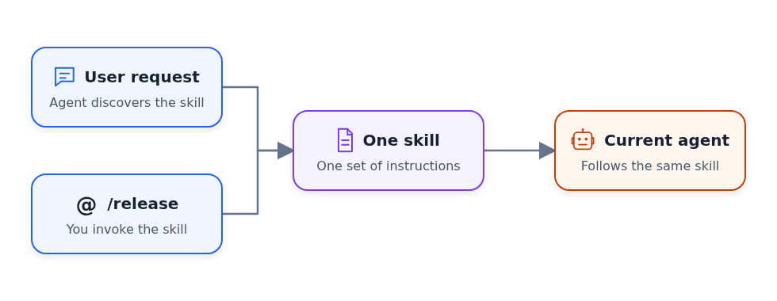
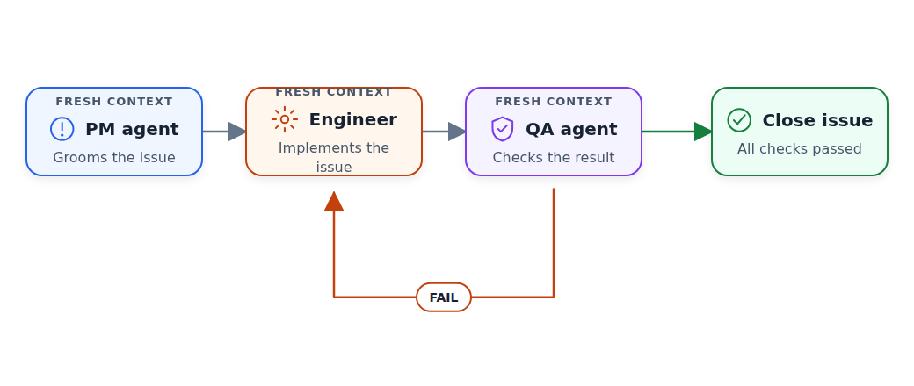

# Coding Agent Building Blocks: Reusable Skills and Specialized Subagents

This is the fifth article in a series based on
[AI Dev Tools Zoomcamp](https://github.com/DataTalksClub/ai-dev-tools-zoomcamp),
the free course we run at DataTalks.Club.

All articles in the series:

- Part 1: [AI-Native Development: Specifications, Loop and Graph Engineering](https://aishippingblog.com/p/ai-native-development-specifications)
- Part 2: [Build and Ship a Full-Stack App with AI Coding Assistants](https://aishippingblog.com/p/build-and-ship-a-full-stack-app-with)
- Part 3: [Deploy a Full-Stack App with AI Coding Assistants](https://aishippingblog.com/p/deploy-a-full-stack-app-with-ai-coding)
- Part 4: [DevOps and Observability for an AI-Built App](https://aishippingblog.com/p/devops-and-observability-for-an-ai)
- Part 5: Coding Agent Building Blocks: Reusable Skills and Specialized Subagents (this article)

In this article, we focus on two capabilities from Module 5 that make coding agents
more reliable: reusable skills and specialized subagents.

The product around the agent can be an IDE, a terminal, or a hosted environment. That interface matters less than the workflow inside it. Skills make a good procedure repeatable. Subagents isolate focused work in fresh context and, when useful, run it in parallel.

## From Article 1 to Explicit Building Blocks

In [Article 1](https://aishippingblog.com/p/ai-native-development-specifications),
we already used both ideas, but we hadn't packaged them as first-class
capabilities:

- `AGENTS.md`, `_docs/process.md`, and the other project documents contained
  reusable instructions.
- `_docs/team/pm.md`, `_docs/team/software-engineer.md`, and
  `_docs/team/qa-engineer.md` described specialized roles that we ran in fresh
  sessions or launched as subagents.

This worked because agent harnesses such as Claude Code, Codex, OpenCode, and
Grok Build can read any Markdown file you point them to. A well-written
`qa-engineer.md` can guide a QA run whether the harness calls it a skill, an
agent definition, a rule, or simply a document. The label and directory matter
less than whether the agent can find and read the instructions.

Formalizing the file still changes how the harness uses it:

- Define a skill when you want the current agent to follow a repeatable
  procedure that the harness can advertise by name, load only when relevant,
  and let you invoke directly.
- Define a separate agent when the task benefits from a fresh context window,
  a focused role, different tool permissions, an independent review, or
  parallel execution.

A skill defines how to do a task. A separate agent defines who owns the task
and gives that worker its own context. For example, a release checklist belongs
in a skill because the current agent can follow it from start to finish. QA is
often better as a separate agent because a fresh reviewer is less likely to
accept the implementer's assumptions.

## Building Block 1: Skills

Skills are reusable, step-by-step workflows that encode best practices into repeatable procedures.

## Skills as Reusable Workflows

A skill is a structured set of instructions that tells the agent exactly what to do for a specific type of task. Instead of giving the agent a vague instruction like "release this library", you give it a detailed playbook with every step spelled out.

## Unified Discovery and Direct Invocation

Previously, skills and commands were two separate concepts:

- Skills were agent-discovered workflows. The agent saw a list of available skills and decided when to load one.
- Commands were user-triggered shortcuts. A user typed something like `/release` to run a predefined workflow.

They're now unified as skills. The agent can discover a skill from a regular
request, or the user can invoke the same skill directly with `/name`.

<figure>
  
  <figcaption>A regular request and a direct invocation select the same skill for the current agent</figcaption>
</figure>

You may still see older repositories and documentation use the word "command"
or store these workflows in a `commands/` directory. In this article, we use
"skill" for both forms.

The AI Shipping Labs workshop
[Build a Coding Agent with Tools, Skills and PydanticAI](https://aishippinglabs.com/workshops/coding-agent-v2)
shows how to build a coding agent with skill support.
It starts with tool calls and an agent loop, adds reusable skills, and then
ports the agent to PydanticAI.

## Shared Skills from `.agents`

I keep my cross-project skills in the public
[`.agents` repository](https://github.com/alexeygrigorev/.agents). It configures
the same collection for Claude Code, Codex, and OpenCode.

These are some of the skills I use regularly:

- [`release`](https://github.com/alexeygrigorev/.agents/tree/main/skills/release)
  bumps the version, pushes a tag, and lets CI publish the package.
- [`init-library`](https://github.com/alexeygrigorev/.agents/tree/main/skills/init-library)
  creates a Python library with packaging, tests, linting, and optional CLI
  support.
- [`create-github-repo`](https://github.com/alexeygrigorev/.agents/tree/main/skills/create-github-repo)
  creates a GitHub repository and pushes the current project.
- [`fetch-youtube`](https://github.com/alexeygrigorev/.agents/tree/main/skills/fetch-youtube),
  [`fetch-loom`](https://github.com/alexeygrigorev/.agents/tree/main/skills/fetch-loom),
  and [`fetch-zoom`](https://github.com/alexeygrigorev/.agents/tree/main/skills/fetch-zoom)
  fetch recordings or transcripts for the agent to analyze.
- [`diagram-creator`](https://github.com/alexeygrigorev/.agents/tree/main/skills/diagram-creator)
  turns a JSON specification into consistent SVG and PNG diagrams.
- [`setup-pypi-ci`](https://github.com/alexeygrigorev/.agents/tree/main/skills/setup-pypi-ci)
  moves Python package publishing into a tag-triggered CI workflow.
- [`regular-ping`](https://github.com/alexeygrigorev/.agents/tree/main/skills/regular-ping)
  manages recurring reminders for long-running terminal sessions.

## Project-Specific Skills

I use shared skills across projects. Project-specific skills stay next to the
code and capture local commands, constraints, and operational knowledge.

For example:

- [PocketShell](https://github.com/alexeygrigorev/pocketshell/tree/main/.claude/skills)
  has skills for connecting to the physical Android device and turning a
  screenshot into a GitHub issue.
- [Course Management Platform](https://github.com/DataTalksClub/course-management-platform/tree/main/.claude/skills)
  has an incident-response skill and a skill for verifying the Django app with
  a throwaway database.
- [AI Engineering Buildcamp](https://github.com/alexeygrigorev/ai-bootcamp/tree/main/.claude/skills)
  has skills for curriculum reorganization and synchronizing lessons after a
  video recording.
- [DataTalks.Club FAQ](https://github.com/DataTalksClub/faq/tree/main/.claude/skills)
  has skills for fetching course questions from Slack and turning recurring
  questions into durable FAQ entries.

## Building Block 2: Subagents

A coding agent has a long but finite context window. In one session, it may
plan, implement, and review a task. As that context fills, the agent can lose
important details or give too much weight to its earlier decisions.

Consider a coding agent that researches an issue, implements it, and then
reviews its own work. Research and implementation fill the context with
different details, while self-review encourages the agent to accept assumptions
it made earlier. A fresh agent can focus on one role without all that history.

A subagent starts with a fresh context window outside the main agent's context.
The main agent gives it a bounded task and receives a result, while the detailed
work happens in isolation.

Because subagents are separate, independent tasks can run at the same time
while the main agent continues coordinating the work.

Long sessions can also make an agent forget details or skip steps. A separate
verifier starts without the implementer's assumptions, so it's more likely to
catch missing work than the agent reviewing its own output.

## Sequential Roles in Article 1

In Article 1, the product manager, software engineer, and QA engineer worked
one after another. The product manager refined an issue, the engineer
implemented it, and QA checked the result in a fresh context. If QA returned
`FAIL`, we sent the findings back to a new engineer session.

We didn't run these roles in parallel because each one depended on the previous
result. The benefit came from role separation and fresh context, not speed.

<figure>
  
  <figcaption>Article 1 used fresh role agents sequentially, with QA failures returning to engineering</figcaption>
</figure>

## Parallel Work in Worktrees

For independent coding tasks, I run several agents at the same time. Each agent
gets its own git worktree, so it can edit, test, and commit without overwriting
another agent's files. The main session becomes the orchestrator and stays out
of feature implementation.

<figure>
  
  <figcaption>Agents work concurrently in isolated worktrees while the orchestrator controls review and merge order</figcaption>
</figure>

I use a prompt like this:

```text
Work in isolated git worktrees and run up to five agents in parallel.

You are the orchestrator. Your job is to:

- Split the backlog into independent issue tracks.
- Give each agent a separate worktree and clear file ownership.
- Keep the agent slots full while eligible work remains.
- Send completed work to a fresh reviewer.
- Return review findings to the correct implementer.
- Merge approved work into the main branch one issue at a time.
- Coordinate the work; do not implement the issues yourself.
```

Worktrees prevent filesystem collisions, but they don't prevent logical
conflicts. Two agents should run in parallel only when they own different files
or independent parts of the system. The orchestrator tracks dependencies,
relays review feedback, and controls the merge order.

I use this approach in larger projects. The
[PocketShell workflow](https://github.com/alexeygrigorev/pocketshell/blob/main/process.md)
allows up to five high-effort background agents. The
[AI Shipping Labs workflow](https://github.com/AI-Shipping-Labs/website/blob/main/_docs/PROCESS.md)
runs independent issue tracks in worktrees with a smaller default concurrency
limit. The
[Raised workflow](https://github.com/alexeygrigorev/raised/blob/main/process.md)
also assigns each issue its own implementer and reviewer loop, with up to five
agents running in parallel.

## Creating and Iterating on Skills

## Creating a New Skill

I don't start by designing a skill. I first do the real task with the agent as
usual. When it takes a wrong turn, I correct it and continue until both the
result and the way we produced it are right.

At the end of the session, I say:

```text
Save this as a skill. Include the workflow we followed and all the corrections
I made, so the next agent can do the task correctly from the start.
```

The completed session records what worked and every correction I made. The
agent can turn that history into a practical skill instead of inventing a
workflow in advance.

I then review the generated `SKILL.md` and remove details that only mattered in
that session. I also make sure its description says when an agent should load
it. If the project already has skills, the agent can follow their structure.

## Improving an Existing Skill

I improve the first version through the same cycle:

1. Trigger the skill and let it run
2. When it does something wrong, correct it in the session
3. After fixing the issue, ask the agent to analyze its actions and your
   corrections
4. The agent analyzes everything and updates the skill file

Skills improve through real usage because each correction improves the next
run.

## Practical Takeaways

The distinction leads to a few practical rules:

- Start with skills: identify repetitive workflows and encode them as markdown playbooks
- Add subagents when context is a problem: if tasks are too large for a single agent session, break them into roles
- Keep skills simple: one workflow per skill. If it branches, split it
- Give each subagent a fresh context window so details from another role don't interfere
- Build incrementally: start with one skill and one subagent. Add more as you discover what your workflow needs
- Always verify: even the best models take shortcuts. Skills encode the "right way" and subagent reviewers catch what the implementer missed

## Resources

These resources cover the course, workshop, and shared skills:

- [AI Dev Tools Zoomcamp](https://github.com/DataTalksClub/ai-dev-tools-zoomcamp) (free course)
- [Build a Coding Agent with Tools, Skills and PydanticAI](https://aishippinglabs.com/workshops/coding-agent-v2)
- [My agent configuration](https://github.com/alexeygrigorev/.agents) (shared skills for Claude Code, Codex, and OpenCode)

## Related Substack Articles

These articles provide more detail on the examples:

- [My Experiments with Claude Code](https://aishippingblog.com/p/my-experiments-with-claude-code)
- [AI-Native Development: Specifications, Loop and Graph Engineering](https://aishippingblog.com/p/ai-native-development-specifications)
