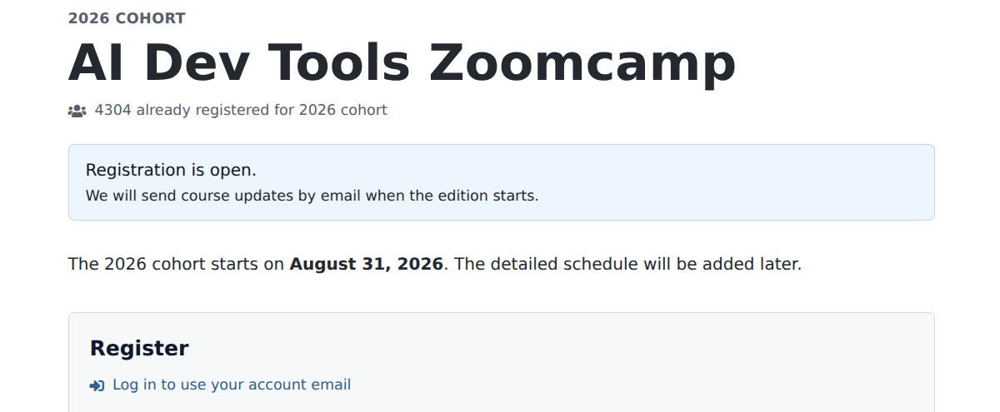
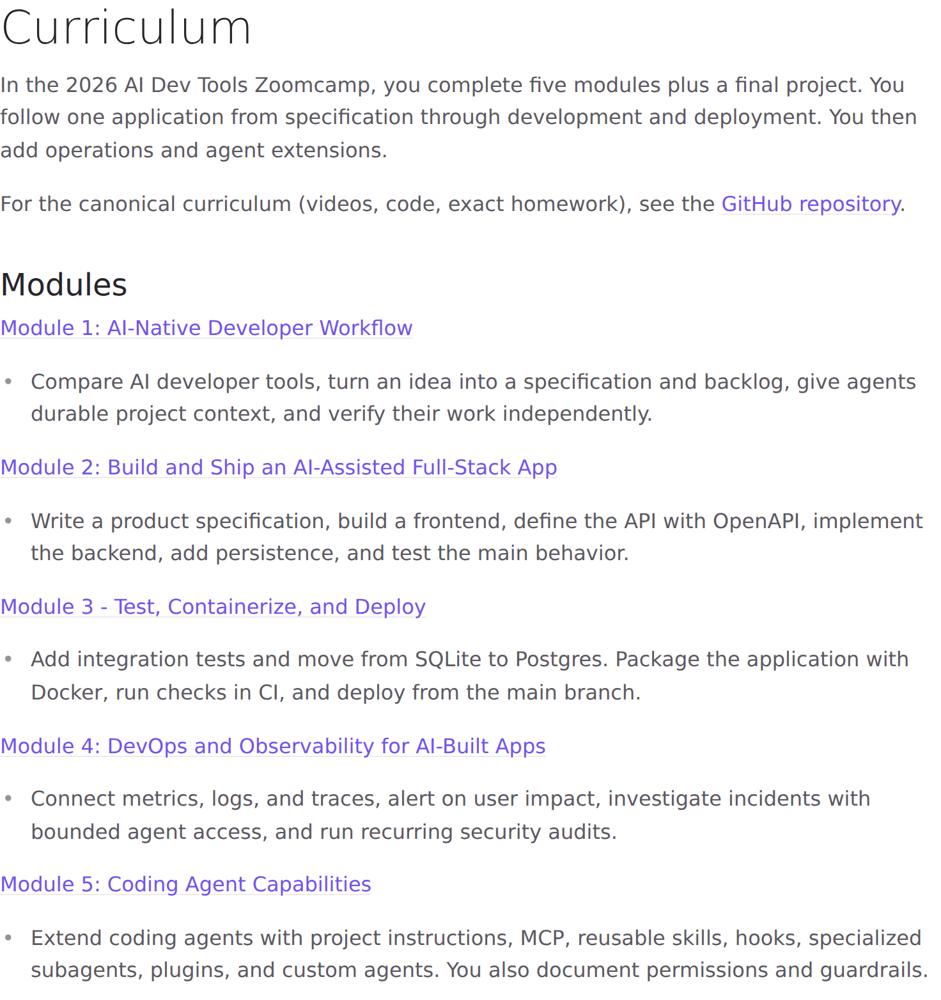

# AI Dev Tools Zoomcamp 2026: From Idea to Production with AI Coding Agents

The 2026 cohort of [AI Dev Tools Zoomcamp](https://github.com/DataTalksClub/ai-dev-tools-zoomcamp) starts on August 31. The course is free, and registration is open.

In this course, we use AI coding tools across the full software-development lifecycle.

- Part 1: [AI-Native Development: Specifications, Loop and Graph Engineering](https://aishippingblog.com/p/ai-native-development-specifications)
- Part 2: [Build and Ship a Full-Stack App with AI Coding Assistants](https://aishippingblog.com/p/build-and-ship-a-full-stack-app-with)
- Part 3: [Deploy a Full-Stack App with AI Coding Assistants](https://aishippingblog.com/p/deploy-a-full-stack-app-with-ai-coding)
- Part 4: [DevOps and Observability for an AI-Built App](https://aishippingblog.com/p/devops-and-observability-for-an-ai)
- Part 5: Coding Agent Building Blocks: Reusable Skills and Specialized Subagents

In this course we give you a tool-agnostic way to work with any coding agent and increate your productivity as a developer.

<p align="center">
  
</p>


## Start here

Use these links to join the course and find the materials:

- [Register for the course](https://courses.datatalks.club/register/ai-dev-tools/). Registration is free.
- [Open the course platform](https://courses.datatalks.club/ai-dev-tools-2026/) to see deadlines, submit homework and projects.
- [Star the course repository](https://github.com/DataTalksClub/ai-dev-tools-zoomcamp). It contains the module materials, recordings, homework, and final-project requirements.
- [Read the course documentation](https://datatalks.club/docs/courses/ai-dev-tools-zoomcamp/) for prerequisites, setup, logistics, and detailed guidance.
- [Join the DataTalks.Club Slack](https://datatalks.club/slack.html) for talking to your peer course participants and join the `#course-ai-dev-tools-zoomcamp` channel.
- [Join the Telegram channel](https://t.me/aidevtoolszoomcamp) for announcements and deadline updates.
- [Save the YouTube playlist](https://www.youtube.com/playlist?list=PL3MmuxUbc_hLuyafXPyhTdbF4s_uNhc43)

<p align="center">
  
</p>


## Course curriculum

Across five modules, you take one application from a rough idea to a deployed system supported by coding agents:

```text
specify → build → ship → operate → extend
```

<p align="center">
  
</p>

## Module 1: AI-Native Developer Workflow

Giving a coding agent a vague request often produces a plausible application that doesn't solve the problem you had in mind. We begin by improving the instructions and context we give it.

You turn a product idea into a specification and a backlog of small tasks. You create durable project context, then separate product management, implementation, and QA into focused sessions. You also learn how agent loops and multi-agent workflows can help with larger backlogs without removing your responsibility for review.

By the end of the module, you have a repeatable way to direct an agent and verify its work independently.

[Module 1 materials](https://github.com/DataTalksClub/ai-dev-tools-zoomcamp/tree/main/01-ai-native-workflow) · [Recording](https://www.youtube.com/watch?v=VUJxJGpaDEs) · [Companion article](https://aishippingblog.com/p/ai-native-development-specifications)

## Module 2: Build and Ship an AI-Assisted Full-Stack App

Next, you use that way of working to create a complete application. You write a product specification and build a frontend. Then you describe the API with OpenAPI, implement the backend, add SQLite persistence, and test the main behavior.

We use AI tools to produce the first version of each part, but we don't accept generated code because it looks reasonable. We look at the code, run it, compare it with the specification, and write tests for the behavior we expect.

You finish with a tested full-stack application that runs locally and follows a documented OpenAPI specification.

[Module 2 materials](https://github.com/DataTalksClub/ai-dev-tools-zoomcamp/tree/main/02-end-to-end) · [Recording](https://www.youtube.com/watch?v=x9dq5nBpDg8) · [Companion article](https://aishippingblog.com/p/build-and-ship-a-full-stack-app-with)

## Module 3: Test, Containerize, and Deploy

A working local application is only the beginning. In this module, you test the seams between the frontend, backend, and database. You add integration tests, move from SQLite to Postgres, package the application with Docker, and run the checks automatically in CI.

Then you deploy the application to a public URL and connect deployment to the CI pipeline. When you merge a change that passes the required checks, the pipeline ships it.

You finish with a containerized application that other people can use and a documented way to test, deploy, and roll it back.

[Module 3 materials](https://github.com/DataTalksClub/ai-dev-tools-zoomcamp/tree/main/03-deployment) · [Recording](https://www.youtube.com/watch?v=gxt5ZDVnBMM) · [Companion article](https://aishippingblog.com/p/deploy-a-full-stack-app-with-ai-coding)

## Module 4: DevOps and Observability for AI-Built Apps

When the deployment command exits successfully, you know only that the command finished. You still need to check whether people can use the application.

You instrument an important request with OpenTelemetry and connect metrics, logs, and traces in Grafana. You write an alert for sustained user impact, collect a bounded evidence packet, and give a coding agent read-only access to that evidence. The agent can investigate and propose an action, while code outside the model enforces which actions are allowed.

You also run recurring security audits and record enough information to reconstruct an incident from the first alert to recovery.

[Module 4 materials](https://github.com/DataTalksClub/ai-dev-tools-zoomcamp/tree/main/04-devops) · [Recording](https://www.youtube.com/watch?v=YkxLo_FRoQw) · [Companion article](https://aishippingblog.com/p/devops-and-observability-for-an-ai)

## Module 5: Coding Agent Capabilities

In the final module, you look inside the coding-agent workflow and extend it around your project.

You work with project instructions, MCP, and reusable skills. You also explore hooks, specialized subagents, plugins, and small custom agents. We focus on each capability rather than one product's name for it, so you can apply the ideas across modern coding agents.

You finish by packaging reusable instructions and a repeatable way to review changes in your application. You also include a specialist agent, an MCP tool or server, guardrails, and documented permissions.

[Module 5 materials](https://github.com/DataTalksClub/ai-dev-tools-zoomcamp/tree/main/05-agent-capabilities) · [Recording](https://www.youtube.com/watch?v=t8OrAjNO2Zs)

## Cohort format

The lectures are pre-recorded, so you don't need to attend a class at a particular time. In a live cohort, we move through the course together with shared deadlines, graded homework, and community support. You can also join the leaderboard, review peer projects, and work toward a certificate.

For each module:

1. Open the module folder in the course repository.
2. Watch the recording and follow the materials.
3. Complete the homework in your own public repository.
4. Submit your answers through the course platform before the deadline.
5. Ask questions and share what you learn in Slack.

Homework is optional for the certificate, but I recommend doing it. It gives you a smaller task for each module, helps you keep pace with the cohort, and prepares you for the final project. On-time homework and learning-in-public contributions also give you leaderboard points.

You can follow all the materials without joining the live cohort. If you study at your own pace, you can watch the same recordings, complete the homework for practice, and build a portfolio project. We offer graded submissions, peer review, and certificates during the live cohort.

Read the [Zoomcamp logistics documentation](https://datatalks.club/docs/courses/zoomcamp-logistics/) for the detailed homework and project rules. It also explains deadlines, peer review, and certificates.

## Final project and certificate

For the [final project](https://github.com/DataTalksClub/ai-dev-tools-zoomcamp/tree/main/project), you choose your own idea and build a complete application with AI assistance.

Your project should include:

- a frontend and backend
- an OpenAPI specification
- persistent storage
- automated tests
- containers and a public deployment
- clear instructions for running the application

You also document how you used AI. Show how you described tasks and gave the agent context. Explain how you reviewed generated code, tested the result, and handled permissions. In the later modules, you add operations, security, and agent-extension work around the application.

Homework isn't required for the certificate. To earn the certificate, you need to submit a passing final project during the live cohort and complete the required peer reviews on time. Check the [course platform](https://courses.datatalks.club/ai-dev-tools-2026/) for the exact project and review deadlines. Read the [certification documentation](https://datatalks.club/docs/courses/zoomcamp-logistics/certification/) for the general certificate workflow.

## Course links

You don't need to remember every link, but it helps to know where to go for each part of the course.

- Use the [course platform](https://courses.datatalks.club/ai-dev-tools-2026/) for the schedule, deadlines, submission forms, scores, project, and certificate.
- Use the [GitHub repository](https://github.com/DataTalksClub/ai-dev-tools-zoomcamp) for module materials, recordings, code, homework, and project requirements.
- Use the [course docs](https://datatalks.club/docs/courses/ai-dev-tools-zoomcamp/) for setup and detailed guidance, and the [Zoomcamp logistics docs](https://datatalks.club/docs/courses/zoomcamp-logistics/) for the shared rules.
- Use the [course Slack channel](https://app.slack.com/client/T01ATQK62F8/C09HWT76L95) for questions and discussion.
- Use [Telegram](https://t.me/aidevtoolszoomcamp) for announcements.
- Use the [YouTube playlist](https://www.youtube.com/playlist?list=PL3MmuxUbc_hLuyafXPyhTdbF4s_uNhc43) for recordings.

## Start the course

Open the [course platform](https://courses.datatalks.club/ai-dev-tools-2026/), star the [course repository](https://github.com/DataTalksClub/ai-dev-tools-zoomcamp), and join [Slack](https://datatalks.club/slack.html) and [Telegram](https://t.me/aidevtoolszoomcamp). Then begin with [Module 1](https://github.com/DataTalksClub/ai-dev-tools-zoomcamp/tree/main/01-ai-native-workflow).

You can still join after August 31. Check the platform for the deadlines that remain, and start working through the materials.
